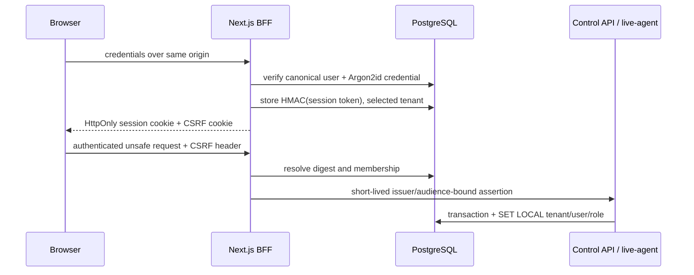

# Authentication architecture

## Ownership

`apps/web` is the same-origin authentication boundary. Its server-only auth
adapter owns credential verification, secure cookies, session rotation, tenant
selection, and authorization checks. PostgreSQL owns canonical identity and
session state. Browsers never receive database or service credentials.

The runtime does not use Firebase Auth, Supabase Auth, a framework-owned
organization model, or a second migration tool.

## Session contract

- The cookie contains 256 bits of random opaque entropy and is never logged.
- PostgreSQL stores only an HMAC-SHA-256 digest under a pepper held outside the
  database.
- Sessions have idle and absolute expiry, explicit revocation state, rotation
  count, selected tenant, and safe client metadata digests.
- Login, tenant switching, and privilege-sensitive events rotate the token.
- Logout and user disablement revoke continued access.
- A non-HttpOnly same-origin CSRF cookie is compared with an explicit request
  header and its session-bound digest on unsafe requests; origin and Fetch
  Metadata checks are also required.

## Authorization

The canonical roles are `owner`, `admin`, `agent`, and `viewer`. A typed,
deny-by-default permission matrix is evaluated server-side. Tenant switching
requires a current membership and rotates the session. Application transactions
derive `app.current_tenant`, `app.current_user`, and `app.current_role` from the
resolved session; browser tenant headers are never authority.

PostgreSQL functions needed before tenant context exists (login/session lookup)
are narrow `SECURITY DEFINER` functions with explicit `search_path`, revoked
`PUBLIC` execution, bounded results, and live privilege tests.

## Deferred capabilities

Public signup, real email delivery, OAuth/OIDC login, MFA/WebAuthn, self-service
recovery, long-lived API tokens, and final platform administration are not Phase
3 claims. Their schema hooks and evaluation criteria remain documented, but each
requires a separate abuse and migration review before activation.
