# CRM and messaging architecture

## Implemented Phase 4 boundary

The authenticated Next.js shell calls same-origin routes. Those routes resolve the
canonical session, enforce permission and CSRF checks for mutations, and execute
repositories inside a transaction carrying `app.current_tenant`,
`app.current_user`, and `app.current_role`. PostgreSQL RLS remains the isolation
authority.

```mermaid
flowchart LR
  UI[Authenticated CRM shell] --> BFF[Next.js same-origin BFF]
  API[Scoped bearer API] --> Key[HMAC-digested API-key resolver]
  BFF --> RLS[Tenant transaction + RLS]
  Key --> RLS
  RLS --> CRM[(crm schema)]
  RLS --> MSG[(messaging schema)]
  RLS --> AUTO[(automation schema)]
  BFF --> JOB[(ops.jobs)]
  JOB --> WORKER[Messaging worker]
  WORKER --> SIM[Simulator adapter]
```

Implemented product surfaces include contacts, notes, tags, custom values, CSV
import/deduplication, shared inbox operations, conversation assignment/status,
reactions, quick replies, delivery history, pipelines/deals, simulator campaigns,
immutable automation publishing/manual empty-graph runs, analytics, team/settings,
notifications, and scoped CRM API keys.

## WhatsApp safety and durability

`ENABLE_REAL_WHATSAPP=false` is the default and remains the accepted development
mode. The simulator writes canonical message and delivery state without an HTTP
request to Meta. Campaign recipients become idempotent PostgreSQL jobs and the
messaging worker claims them through `FOR UPDATE SKIP LOCKED`, bounded attempts,
leases, stale-lease recovery, exponential backoff, and terminal failure state.

The real-provider route is present but returns `404` while the real-provider flag
is false. When deliberately enabled later, it verifies `X-Hub-Signature-256`
against the exact raw request bytes, defensively parses supported text envelopes,
and calls a narrow PostgreSQL function that persists a unique inbound event before
acknowledgement. The worker owns domain ingestion. No detached best-effort webhook
processing exists.

Neither tokens nor app secrets are persisted in browser state, logs, event
payloads, provider snapshots, or API-key rows. API keys are generated once,
stored only as keyed HMAC digests, scoped to `crm:read`/`crm:write`, RLS-owned by
one tenant, and resolved through a narrow `SECURITY DEFINER` function.

## Preserved behavior and deferred work

WACRM contact, inbox, pipeline, campaign, automation, and webhook semantics inform
the adapters. Supabase Auth, Realtime, Storage, RPC coupling, and its migration
runner are absent. The full WACRM UI and provider runtime were not copied.

The CRM tool descriptors are MCP-compatible application contracts with read tools
and confirmation-gated writes; exposing them through the future unified MCP
transport remains deferred. Real Meta activation, media/template-provider APIs,
team invitations, and a full visual automation editor also remain deferred and
must not be inferred from this foundation.
