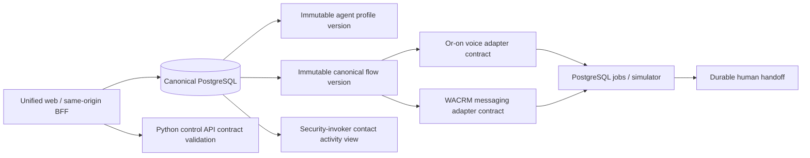

# Cross-channel orchestration

Phase 6 adds one governed control plane over the retained Or-on voice and WACRM
messaging engines. It does not replace either engine and contains no OpenLive
runtime path.



## Source parity and preservation

| Concern | Preserved source behavior | Phase 6 adaptation |
| --- | --- | --- |
| Voice flow | Or-on typed component graph, published flow versions, Pipecat execution | Canonical nodes compile to `oron-flow.v1`; actual execution remains in retained `oron-flows`/`oron-agent`. |
| Messaging automation | WACRM draft/publish, CRM actions, WhatsApp message steps | Canonical nodes compile to `wacrm-automation.v1`; delivery remains worker-owned, simulator-default, and optionally Meta-gated. |
| Agents | Or-on voice configuration plus WACRM AI/tool/knowledge intent | Tenant profile with immutable versions and explicit `voice`/`whatsapp` capabilities. Secrets remain references. |
| State changes | Source-specific automation/call/message records | Domain records stay authoritative; `platform.contact_activity` is a read-only union. |
| Retry/replay | Source idempotency and resumable delivery | Canonical `ops.jobs` keys and conditional handoff transitions. |

## Canonical contract

Schema version `1.0` supports `start`, `end`, `voice.call`, `message.send`,
`crm.update`, and `handoff`. The validator requires one start, at least one end,
unique node IDs, valid edge references, and at least one channel. A channel-only
node is rejected when none of the selected channels supports it.

Compilation sorts nodes and edges by stable IDs. Shared nodes appear in both
adapters; voice-only and message-only nodes appear only in the corresponding
adapter. The compiled artifact is persisted with the canonical flow version.
Published profile and flow versions are immutable PostgreSQL records.

Publication now validates actionable configuration and one reachable, acyclic,
unambiguous path per channel (at most 100 nodes / 200 edges). Execution follows
edges, not the sorted artifact array. Unsupported branching, disconnected nodes,
unknown action options and embedded credential fields fail closed. The Python
validation endpoint remains a structural contract check; the BFF publication
gate also checks action configuration and retained voice references.

`cross_channel.flow.simulated` is a durable coordinator over existing action
ports, not a replacement voice or messaging engine. It pins the published
canonical/agent versions, rechecks active flow-management membership, applies
allow-listed CRM fields, queues a child message/call, persists `waiting`, and
resumes only after child success. A failed child stops the run before handoff.
Polling does not consume retry attempts; a persisted 15-minute deadline bounds
the simulator. Duplicate admission keys are serialized per tenant and must match
the original input. Run/step states are visible in **Automations**.

Voice actions reference an exact retained `public.flows` UUID/version. The
adapter loads the frozen `oron_flows.FlowSpec`, validates identity/version and
never re-expands a published composition. The local consumer records simulator
session/event effects, not real audio. A separate provider-free parity test feeds
this same adapter output to the **retained Pipecat binder**, traverses its handler
and verifies Hebrew prompts and terminal actions. No carrier/LLM/audio execution
is claimed by the simulator.

Messaging retains WACRM `{{vars.key}}` interpolation and numeric template
parameter ordering, using existing canonical CRM/WhatsApp action ports. Object
parameters are rejected rather than stringified ambiguously. This is the
accepted six-node Phase 6 subset, not full WACRM engine parity: waits,
conditions, outbound HTTP, parallel branches and advanced source actions remain
unsupported. Legacy empty manual proofs remain available; nonempty canonical
flows cannot use the old immediate-success manual-run shortcut.

The FastAPI `POST /api/v1/orchestration/flows/validate` contract provides the
cross-language validation/adapter shape and generates the TypeScript client from
OpenAPI. Stateful product commands remain same-origin BFF operations over a
tenant-local PostgreSQL transaction.

## Safe workflows

- Call outcome → WhatsApp: only a terminal, contact-linked retained session can
  enqueue `cross_channel.whatsapp_followup.simulated`, with granted WhatsApp
  consent and no opt-out. The messaging worker rechecks consent under a row lock,
  requires literal simulator mode and the expected contact reference, and writes
  a clearly labeled local follow-up to a simulator channel. Message, receipt,
  and owned-job completion commit together. Stable provider IDs derived from the
  job prevent duplicates on replay. Neither provider adapter is invoked. No
  inbound message is fabricated and inbox unread counts are preserved.
- WhatsApp → CRM → call: the conversation supplies the canonical contact; a call
  job is denied unless voice consent is granted and the contact is active.
  The control API's process-owned simulator consumer claims only voice-simulation
  jobs under `platform_voice`. It rechecks/locks membership, consent and ownership
  through a narrow PostgreSQL function. Retained simulator session/events,
  audit/outbox and job completion share one transaction; retries roll back effects.
  It has no selectable carrier/provider port. Stop/restart the control API after
  applying migration `3f6133842389` to enable the new lifecycle hook locally.
- Handoff: request keys are tenant-idempotent and accept/resolve/cancel updates
  use compare-and-set status predicates. Concurrent accepts yield one winner.

Cross-channel demonstrations continue to enqueue literal simulator jobs. Direct
Inbox delivery may separately enqueue `whatsapp.outbound.send`; Meta is never a
fallback and requires explicit provider selection, consent, confirmation, and
both admission/provider kill switches. See
[Meta WhatsApp delivery](whatsapp-cloud-api.md).

### Local worker verification

Set `CROSS_CHANNEL_TEST_DATABASE_URL` to an explicit **localhost test PostgreSQL**
migration connection with permission to create disposable databases, then run:

```sh
pnpm --filter @or-on/crm build
pnpm --filter @or-on/messaging-worker exec vitest run tests/call-followup.live.test.ts
```

The suite migrates/seeds a new UUID-named database and removes it in teardown.
It never reads `.env`, changes existing runtime-role passwords, processes the
development queue, or seeds over the development login. Admission and worker
connections use PostgreSQL startup `SET ROLE` privileges, asserted in the test;
they do not exercise production login credential provisioning. Provider spies
fail if a real provider is invoked; template tests use the local simulator.
Ordinary offline tests skip this explicitly opt-in suite.

## Activity, usage, and cost

`platform.contact_activity` uses PostgreSQL 18 `security_invoker` semantics and
the RLS policies of messages, sessions, deals, flow runs, broadcast recipients,
and handoffs. It exposes identifiers/status metadata, not message bodies,
transcripts, phone numbers, prompts, or secrets.

Usage aggregates token counts, average latency, voice sessions, and messaging
jobs. Monetary cost remains `null` with an explicit unpriced count until a
versioned price book exists; the UI never fabricates a cost.

## Deferred final-phase boundary

OpenLive, Live Lab, visual context, browser-local media, WebGPU, ACP/MCP, and the
desktop application remain disabled and are scheduled for Phase 9. `openlive`
is intentionally rejected as a Phase 6 executable channel.
