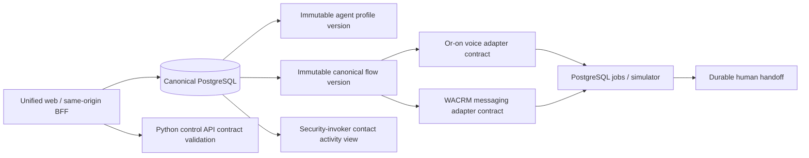

# Cross-channel orchestration

Phase 6 adds one governed control plane over the retained Or-on voice and WACRM
messaging engines. It does not replace either engine and contains no OpenLive
runtime path.

## Source parity and preservation

| Concern | Preserved source behavior | Phase 6 adaptation |
| --- | --- | --- |
| Voice flow | Or-on typed component graph, published flow versions, Pipecat execution | Canonical nodes compile to `oron-flow.v1`; actual execution remains in retained `oron-flows`/`oron-agent`. |
| Messaging automation | WACRM draft/publish, CRM actions, WhatsApp message steps | Canonical nodes compile to `wacrm-automation.v1`; delivery remains worker-owned, simulator-default, and optionally Meta-gated. |
| Agents | Or-on voice configuration plus WACRM AI/tool/knowledge intent | Tenant profile with immutable versions and explicit `voice`/`whatsapp` capabilities. Secrets remain references. |
| State changes | Source-specific automation/call/message records | Domain records stay authoritative; `platform.contact_activity` is a read-only union. |
| Retry/replay | Source idempotency and resumable delivery | Canonical `ops.jobs` keys and conditional handoff transitions. |

## Canonical contract

Schema version `1.0` supports `start`, `end`, `voice.call`, `message.send`,
`crm.update`, and `handoff`. The validator requires one start, at least one end,
unique node IDs, valid edge references, and at least one channel. A channel-only
node is rejected when none of the selected channels supports it.

Compilation sorts nodes and edges by stable IDs. Shared nodes appear in both
adapters; voice-only and message-only nodes appear only in the corresponding
adapter. The compiled artifact is persisted with the canonical flow version.
Published profile and flow versions are immutable PostgreSQL records.

The FastAPI `POST /api/v1/orchestration/flows/validate` contract provides the
cross-language validation/adapter shape and generates the TypeScript client from
OpenAPI. Stateful product commands remain same-origin BFF operations over a
tenant-local PostgreSQL transaction.

## Safe workflows

- Call outcome → WhatsApp: only a terminal, contact-linked retained session can
  enqueue `cross_channel.whatsapp_followup.simulated`.
- WhatsApp → CRM → call: the conversation supplies the canonical contact; a call
  job is denied unless `voice_consent = 'granted'`.
- Handoff: request keys are tenant-idempotent and accept/resolve/cancel updates
  use compare-and-set status predicates. Concurrent accepts yield one winner.

Cross-channel demonstrations continue to enqueue literal simulator jobs. Direct
Inbox delivery may separately enqueue `whatsapp.outbound.send`; Meta is never a
fallback and requires explicit provider selection, consent, confirmation, and
both admission/provider kill switches. See
[Meta WhatsApp delivery](whatsapp-cloud-api.md).

## Activity, usage, and cost

`platform.contact_activity` uses PostgreSQL 18 `security_invoker` semantics and
the RLS policies of messages, sessions, deals, flow runs, broadcast recipients,
and handoffs. It exposes identifiers/status metadata, not message bodies,
transcripts, phone numbers, prompts, or secrets.

Usage aggregates token counts, average latency, voice sessions, and messaging
jobs. Monetary cost remains `null` with an explicit unpriced count until a
versioned price book exists; the UI never fabricates a cost.

## Deferred final-phase boundary

OpenLive, Live Lab, visual context, browser-local media, WebGPU, ACP/MCP, and the
desktop application remain disabled and are scheduled for Phase 9. `openlive`
is intentionally rejected as a Phase 6 executable channel.
