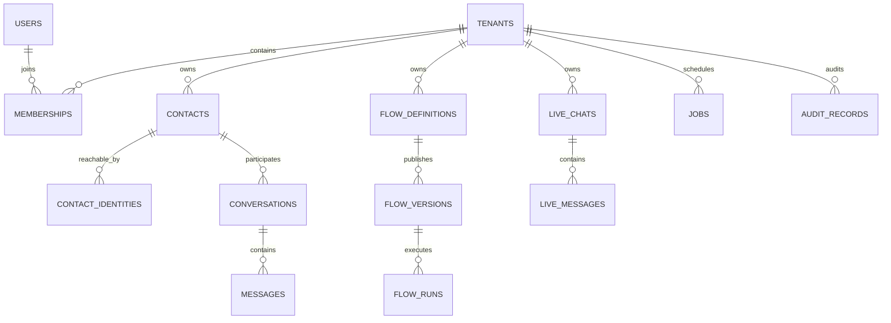

# Canonical data model

## Model rules

`tenants.id` is the only organization/isolation key and canonical users remain
the only user hierarchy. A contact is a human or business entity; phone,
WhatsApp, email, and future channel identifiers are separate contact identities.
Domain records stay in domain tables. The customer activity timeline is a
read-only `UNION ALL` view over messages, calls, automation runs, campaigns, and
deal changes rather than a giant polymorphic write table.

## Entity catalog

| Entity group | Classification / provenance | Tenant scope and key | Sensitive fields and ownership | Principal indexes / deletion |
| --- | --- | --- | --- | --- |
| `tenants`, `users`, `user_identities`, `memberships` | **Existing preserved Or-on tables**; `user_identities` is historical compatibility state | UUIDs; memberships join user and tenant | Canonical tenant/user/RLS context; new provider bindings no longer target this legacy identity table | Historical indexes/FKs preserved; membership cascades as authored upstream. |
| `platform.identity_bindings` | **New unified table**, WACRM-adapted semantics | Global provider binding to canonical `users.id` | Provider subject/email, never session claims | Unique provider+subject; user deletion cascades. |
| `platform.tenant_invitations` | **New unified table**, WACRM-adapted semantics | `tenant_id`, UUID | Hashed invite token; invitee email and intended role | Unique token hash; explicit expiry/acceptance state. |
| `crm.contacts` | **WACRM-adapted table** | `tenant_id`, UUID | Name, email/company, assignment | Tenant/name/activity indexes; tenant deletion cascades, referenced users set null. |
| `crm.contact_channel_identities` | **New unified table**, WACRM + Or-on privacy direction | `tenant_id`, UUID | Normalized E.164, original display, provider IDs, optional ciphertext/blind index | Unique tenant/channel/normalized value and scoped provider ID; contact cascade. |
| CRM tags, custom fields/values, notes | **WACRM-adapted tables** | `tenant_id`, UUID | Notes/custom values can contain customer data | Tenant/name and contact/time indexes; join rows cascade, definitions restrict while referenced. |
| Pipelines, stages, deals | **WACRM-adapted tables** | `tenant_id`, UUID | Deal value/currency/ownership | Tenant/status/stage and position indexes; stage/pipeline deletes restrict when deals exist. |
| `platform.campaigns` plus historical `campaigns` | **New canonical parent + preserved Or-on voice projection** | `tenant_id`, UUID | Channel-neutral campaign lifecycle | Tenant/status/schedule keyset index; source execution rows retain domain FKs. |
| `sessions`, `session_events`, `campaign_contacts` | **Preserved Or-on call records + new target-owned bridges/events** | `tenant_id`; session UUID and ordered event sequence | Encrypted phone fields remain on `sessions`; artifact bytes remain outside PostgreSQL; event payloads must be secret-free | Tenant/contact/time call cursors; provider/request/event idempotency; composite tenant FKs; session-event rows cascade only with their session. |
| Messaging channels/conversations/messages/status events | **WACRM-adapted tables** | `tenant_id`, UUID | Message content/media refs/provider snapshots | Conversation activity, message `(conversation_id, created_at, id)`, unique provider IDs; message cascade only with conversation. |
| Templates, quick replies, broadcasts/recipients | **WACRM-adapted tables** | `tenant_id`, UUID | Template variables and safe provider metadata | Provider template ID, campaign/status claim and recipient/provider message indexes. |
| Flow definitions/versions/runs/step runs | **New unified tables**, WACRM-adapted; Or-on flows preserved | `tenant_id`, UUID | Versioned JSONB definition and safe errors | Unique version numbers; every published version is immutable; run/status/time indexes. |
| Knowledge documents/chunks | **WACRM-adapted tables** | `tenant_id`, UUID | Extracted text and source metadata | PostgreSQL FTS GIN; optional vector column is not required. |
| `live.*` chats/messages/preferences/providers/voice profiles/sessions | **OpenLive-adapted tables** | tenant/user scoped UUIDs | Transcript content, workspace paths, credential references, voice metadata | Chat recency, append sequence, user preference key, provider kind, session IDs. Audio bytes live in object storage. |
| `objects.object_metadata` | **New unified table** | `tenant_id`, UUID | Storage key/checksum/retention metadata, no binary body | Unique backend+storage key and owner lookup; restrict deletion while referenced. |
| `ops.inbound_events`, `outbox_events`, `jobs`, `idempotency_keys` | **New unified tables**, WACRM reliability semantics | tenant nullable only for truly global work | Payloads must be secret-free; safe errors only | Unique provider/idempotency keys, ready/lease indexes, terminal states. |
| `audit.records` | **New unified table** | `tenant_id`, UUID | Actor/target/correlation/safe metadata | Tenant/time/id keyset index; runtime update/delete denied. |

## Contacts and phone privacy

E.164 is the canonical normalized value when validation succeeds. Original
display values are optional and never the sole deduplication key. Existing Or-on
encrypted caller fields and blind indexes are not weakened or rewritten. The
canonical contact identity model can carry ciphertext/blind-index metadata when
a channel needs the same privacy boundary.

## Activity timeline

The planned initial query layer is a repository-owned `UNION ALL` query with a
stable cursor `(occurred_at, activity_id)`. Phase 2A does not materialize a view
before the retained call and automation adapters define their final columns. It
will read domain records and will not become an authoritative event store. If
measured workloads later require a projection, the outbox event ID becomes its
idempotency key; that is a future measured change, not a Phase 2A assumption.

Phase 5 keeps `sessions` as the authoritative call record. Nullable,
tenant-consistent references link it to `crm.contacts`, `platform.campaigns`,
and recording/transcript `objects.object_metadata`; historical calls are not
assigned fabricated relationships. `session_events` stores ordered lifecycle
detail and provider-event/request idempotency below a session. It is not a
second call table and does not replace `ops.outbox_events`, which remains the
durable delivery boundary.

Alembic `7beb64e1ff33` adds `crm.contacts.voice_consent` with fail-safe
`unknown` default and normalized voice policy columns on `platform.campaigns`:
`voice_flow_id`, concurrency and attempt bounds, IANA timezone, weekday-hour
configuration, and completion time. Historical canonical voice campaign rows
may keep a null flow; new control-API campaigns require an existing visible
published flow. Audience queries require active contacts, explicit `granted`
consent, and a usable E.164 phone/WhatsApp identity. High-volume call lists keep
the existing `(tenant_id, created_at, session_id)` cursor index.
