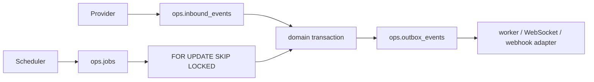

# PostgreSQL durable eventing and jobs

Inbound provider events are deduplicated by provider/account/event identifiers
before effects. Domain mutations and outbox insertion share one transaction.
Outbox rows are durable; `LISTEN/NOTIFY` may wake a worker but is never the source
of truth. `ops.idempotency_keys` records request scope, request hash, status, and
safe response metadata.

Jobs have bounded attempts, `available_at`, lease owner/time, safe last error,
completion time, and terminal failure state. Claiming is an atomic PostgreSQL
operation using `FOR UPDATE SKIP LOCKED`; stale leases become eligible after the
configured timeout. Retry delay is exponential backoff with bounded jitter and a
maximum attempt count. No infinite retry exists.

Payloads are JSONB because event/job bodies are versioned, but tenant, type,
status, aggregate/reference IDs, idempotency/provider IDs, and scheduling fields
are normalized and indexed. Secrets and raw credentials are prohibited.

DDL/functions and concurrency tests are prepared offline. Actual atomic claims,
lease recovery, retry scheduling, dead-letter behavior, and transaction
interactions are **PENDING LIVE POSTGRESQL VALIDATION — PHASE 2B**.
