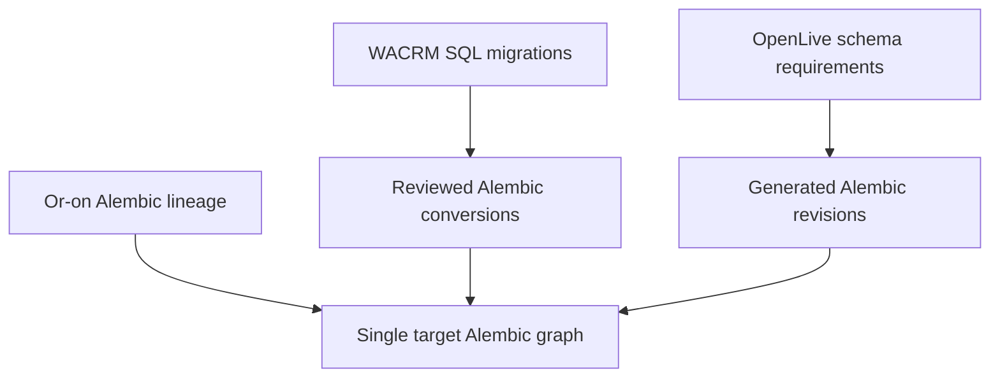

# Database strategy

## One database, one migration authority

`or_on_platform_dev` on PostgreSQL 18.6 is the only target runtime database.
Alembic owns every schema change. TypeScript database types are consumers; no
Prisma, Drizzle, TypeORM, Supabase, or framework migration runner is permitted.

Phase 2A preserves the complete 22-revision Or-on history and continues from its
head. The Phase 1 metadata proof was never applied to a persistent database, is
retired outside the active version location, and is recreated by a generated
successor revision. WACRM SQL is translated into coherent canonical migrations;
OpenLive SQLite/JSON/file state is represented by PostgreSQL tables and a
one-time importer. Exactly one Alembic graph and head remain active.

## Future source conversion



WACRM SQL is retained where valid PostgreSQL behavior is useful; Supabase-specific
auth/storage/realtime dependencies are translated. OpenLive SQLite/JSON is never a
target migration authority.

## Roles and least privilege direction

| Role | Intended use | Prohibited use |
| --- | --- | --- |
| `platform_migrator` | Alembic DDL, grants, controlled data migrations | Application requests |
| `platform_web` | BFF business queries within tenant/user context | DDL, provider credential decryption outside approved APIs |
| `platform_messaging` | Messaging/inbox/outbox/jobs scopes | Voice/control privileged tables |
| `platform_voice` | Voice/session/control scopes | CRM administration and credential catalog writes |
| `platform_worker` | Bounded durable job claims/execution | Schema ownership/superuser |
| `platform_readonly` | Audited operational read models | Writes or secret material |

Historical Or-on roles remain intact. Generated successor migrations add the six
platform roles without granting `SUPERUSER`, `CREATEDB`, `CREATEROLE`, or
`BYPASSRLS`. Application readiness uses a runtime DSN and never assumes schema
ownership. Phase 2B role/grant validation passed on PostgreSQL 18.6.

## Tenant context and RLS

Later tenant transactions set only transaction-local values:

```sql
SET LOCAL app.current_tenant = '<tenant-uuid>';
SET LOCAL app.current_user = '<user-uuid>';
SET LOCAL app.current_role = '<role-name>';
```

Tenant tables use forced RLS and fail closed when context is missing. Application
`WHERE tenant_id = ...` clauses may improve query clarity/performance but never
replace RLS. Pool tests must prove context cannot leak after commit/rollback.

Or-on `tenants.id` remains the canonical isolation key. UI language may say
organization, but the database does not create a parallel organization owner.
New tenant tables carry `tenant_id`, enable and force RLS, and compare it to
`current_setting('app.current_tenant', true)`. Membership-sensitive operations
also use `app.current_user` and canonical memberships. Phase 2B live tests prove
missing context fails closed, cross-tenant CRUD is denied, membership context is
enforced, and transaction-local context clears after the transaction.

## Schema ownership

Mature Or-on tables remain in their historical location. New tables use bounded
schemas only where ownership is clearer: `platform`, `crm`, `messaging`,
`automation`, `agents`, `live`, `objects`, `ops`, and `audit`. Cross-schema
foreign keys are intentional. Query-critical ownership, status, time,
idempotency, and scheduling fields are columns; flexible provider snapshots and
versioned definitions use JSONB.

New globally referenced entities use UUIDs and application instants use
`TIMESTAMPTZ`. High-volume chronological indexes include a stable ID tiebreaker
for keyset pagination. Delete actions are explicit. See
[data-model.md](data-model.md) and [schema ownership](../migration/schema-ownership.md).

## Extensions

| Extension | Classification | Reason |
| --- | --- | --- |
| `citext` | required | Preserved Or-on identity email semantics. |
| `vector` / pgvector | optional | Semantic retrieval enhancement only; PostgreSQL FTS remains functional without it. |
| `pgcrypto` | deferred | PostgreSQL 18 provides `gen_random_uuid()` in core; add the extension only if a reviewed database-owned cryptographic operation later requires it. |

Phase 2B proves `citext` installs and works on PostgreSQL 18.6. The base graph
does not create or require pgvector or `pgcrypto`; PostgreSQL FTS works without
either optional path.

## Durable work direction

Future provider events and background work use PostgreSQL inbox, outbox, and job
tables with unique provider IDs, idempotency keys, leases, `SKIP LOCKED`, bounded
retry/backoff with jitter, next-attempt timestamps, dead-letter state, and trace
IDs. `LISTEN/NOTIFY` is an optional wake-up optimization only.

Kafka and RabbitMQ are not justified. Redis is never authoritative application
state.

## Development and test safety

- Host mapping is loopback-only on port 5433.
- The data directory uses a named Docker volume.
- Test databases have distinct names/DSNs and may be reset only after explicit
  safety checks.
- Seeds are deterministic, fictional, and idempotent.
- Migration checks assert one head, connectivity, current revision, and model
  drift where models exist.
- Runtime code receives one `DATABASE_URL`. Operator commands separately read
  `MIGRATION_DATABASE_URL`; both point to the same database/cluster and the
  migration DSN is never passed to application containers.
