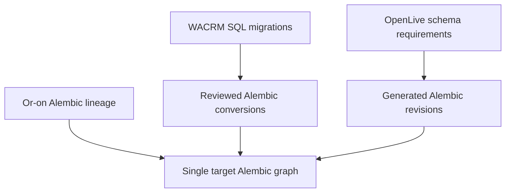

# Database strategy

## One database, one migration authority

`or_on_platform_dev` on PostgreSQL 18 is the only Phase 1 runtime database.
Alembic owns every schema change. TypeScript database types are consumers; no
Prisma, Drizzle, TypeORM, Supabase, or framework migration runner is permitted.

Phase 1 creates a minimal platform metadata revision to prove connectivity and
deterministic state. It does not fabricate the integrated CRM, messaging, voice,
flow, or agent schema. Or-on's existing 22-revision history will be imported
without squashing in Phase 2, after the target migration bootstrap is reconciled
through an explicit preservation plan.

## Future source conversion



WACRM SQL is retained where valid PostgreSQL behavior is useful; Supabase-specific
auth/storage/realtime dependencies are translated. OpenLive SQLite/JSON is never a
target migration authority.

## Roles and least privilege direction

| Role | Intended use | Prohibited use |
| --- | --- | --- |
| `platform_migrator` | Alembic DDL, grants, controlled data migrations | Application requests |
| `platform_web` | BFF business queries within tenant/user context | DDL, provider credential decryption outside approved APIs |
| `platform_messaging` | Messaging/inbox/outbox/jobs scopes | Voice/control privileged tables |
| `platform_voice` | Voice/session/control scopes | CRM administration and credential catalog writes |
| `platform_worker` | Bounded durable job claims/execution | Schema ownership/superuser |
| `platform_readonly` | Audited operational read models | Writes or secret material |

Phase 1 documents roles and uses the development owner for migration/bootstrap
only. Application readiness uses the configured application DSN and never assumes
superuser privileges in deployed environments.

## Tenant context and RLS

Later tenant transactions set only transaction-local values:

```sql
SET LOCAL app.current_tenant = '<tenant-uuid>';
SET LOCAL app.current_user = '<user-uuid>';
SET LOCAL app.current_role = '<role-name>';
```

Tenant tables use forced RLS and fail closed when context is missing. Application
`WHERE tenant_id = ...` clauses may improve query clarity/performance but never
replace RLS. Pool tests must prove context cannot leak after commit/rollback.

Phase 1 creates no fake tenant table merely to demonstrate RLS; the RLS primitives
and negative tests arrive with canonical identity tables in Phase 2.

## Durable work direction

Future provider events and background work use PostgreSQL inbox, outbox, and job
tables with unique provider IDs, idempotency keys, leases, `SKIP LOCKED`, bounded
retry/backoff with jitter, next-attempt timestamps, dead-letter state, and trace
IDs. `LISTEN/NOTIFY` is an optional wake-up optimization only.

Kafka and RabbitMQ are not justified. Redis is never authoritative application
state.

## Development and test safety

- Host mapping is loopback-only on port 5433.
- The data directory uses a named Docker volume.
- Test databases have distinct names/DSNs and may be reset only after explicit
  safety checks.
- Seeds are deterministic, fictional, and idempotent.
- Migration checks assert one head, connectivity, current revision, and model
  drift where models exist.
- Runtime code has one `DATABASE_URL`; role-specific DSNs still point to the same
  database/cluster.
