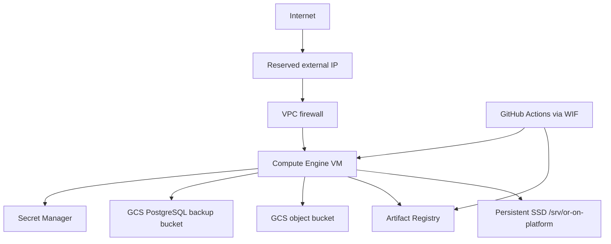

# GCP development target

## Scope

The future shared development environment is one Google Compute Engine VM running
Docker Compose. It is not a production, multi-region, Kubernetes, GKE, Cloud Run,
or service-mesh design. Phase 1 creates constraints and documentation only; no
cloud resource is created and `terraform apply` is prohibited.

## Planned resource graph

Planned resources:

- VPC/subnet and minimal firewall rules;
- reserved external address;
- supported Ubuntu or Debian LTS Compute Engine VM;
- attached persistent SSD mounted below `/srv/or-on-platform`;
- Artifact Registry repository;
- private-by-default GCS media/object and PostgreSQL backup buckets;
- Secret Manager resource names/IAM bindings without secret values;
- least-privilege VM service account;
- GitHub Actions Workload Identity Federation;
- OS Login/IAP-compatible administration;
- optional DNS only when a domain exists.

## VM runtime

Caddy owns the public HTTP/HTTPS origin and proxies web, API, WebSocket, and
provider webhook routes. PostgreSQL and internal services stay on private Compose
networks. Only verified HTTP/HTTPS and later LiveKit/SIP/media ports are exposed.
PostgreSQL is never publicly reachable.

PostgreSQL 18 runs on the attached disk initially. Database configuration stays
portable so Cloud SQL remains a future documented option, not a Phase 1 service.

## Identity and secrets

The VM reads secrets through its service identity. CI authenticates through
Workload Identity Federation and never stores a service-account JSON key. Terraform
defines secret resources and access, not secret values; provider credentials are
never state inputs.

## Backups and deploys

Future deployment builds commit-addressed images, produces SBOMs/scans, backs up
before migration, runs a one-shot migrator, waits for readiness, runs smoke tests,
and restores the previous image set on failure. Scheduled compressed PostgreSQL
backups go to a versioned/lifecycle-managed GCS bucket with checksums. Recovery is
not called verified until a restore-to-new-database exercise passes.

## Terraform Phase 1 boundary

The Terraform root will declare modern version constraints and document variables,
but no spend-bearing resources need to be implemented to complete Phase 1. Local
verification never requires gcloud, Terraform credentials, or an initialized
remote backend.
