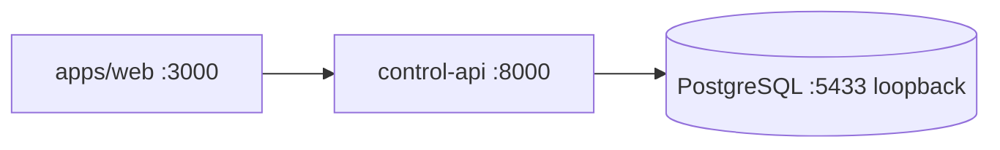

# Local development architecture

## Supported workflow

```bash
make doctor
make bootstrap
make dev
```

`make doctor` is diagnostic and never installs tools. `make bootstrap` synchronizes
the target workspaces, starts the Phase 1 core PostgreSQL service, migrates,
generates contracts, seeds fictional development data where a schema exists, and
checks health. `make dev` coordinates the implemented host processes and leaves
provider flags false.

Phase 1 favors PostgreSQL in Docker and hot-reload application processes on the
host. The production-shaped `core` Compose profile also contains the unified web
and control-api containers, but `make bootstrap` starts only PostgreSQL before
`make dev` coordinates all currently implemented host processes. Container builds
prove independent production packaging without degrading the edit/reload loop.

`platform_migrator` is used only by explicit migration/bootstrap commands.
Readiness and ordinary app traffic use the non-superuser `platform_web` role. The
authenticated voice repository uses the non-superuser `platform_voice` role.
The bootstrap SQL idempotently assigns fictional localhost-only passwords to
both login roles; production credentials remain outside migrations and source
control. All DSNs still target the same PostgreSQL database; they are not
separate runtime databases.

## Prerequisites

- Git
- Docker Engine/Desktop with Compose v2
- Node.js 24 LTS
- pnpm 11.24
- Python 3.14
- uv 0.12
- GNU Make or a compatible invocation environment

Hosting credentials, LiveKit, Redis, and provider credentials are
not localhost core prerequisites.

## Safety defaults

`.env.example` documents all supported groups. A developer may copy it to ignored
`.env`; target commands never overwrite an existing local environment file.

```dotenv
ENABLE_REAL_TELEPHONY=false
ENABLE_REAL_WHATSAPP=false
```

The flags are validated in both language configuration packages. They are not a
complete authorization mechanism: future real actions also require an explicit
user approval at the action boundary.

## Phase 1 core



Future profiles add LiveKit/SIP/Redis, dispatcher/voice-agent, provider simulators,
and optional observability. The live-agent and messaging-worker already run in
host-development mode but are intentionally absent from the production-shaped
core until their retained engines are integrated. Profiles never change the
single-database rule.

## Command behavior

Commands are repeatable and fail with clear messages. Destructive reset/restore
commands require exact development database targets and explicit confirmation;
they are not part of ordinary Phase 1 verification. No normal command contacts a
provider, creates a tunnel, modifies a webhook, or provisions infrastructure.

The canonical port registry is maintained in
[runtime-topology.md](runtime-topology.md).

## Phase 2 database verification

`make migration-graph`, `make migration-sql`, and `make db-contract-check` are
server-free. `make db-verify-offline` combines graph/parent/one-head checks,
deterministic PostgreSQL SQL, schema/RLS/index/extension/security guards,
importer fixtures, the existing prohibited-runtime guard, and wire-contract
freshness. It does not weaken `make migration-check`.

`make db-verify-live` requires `TEST_DATABASE_URL` or
`MIGRATION_DATABASE_URL` for an isolated PostgreSQL 18.6 database. It is the
Phase 2B surface and does not fall back to SQLite, mocks, or an in-memory store.
