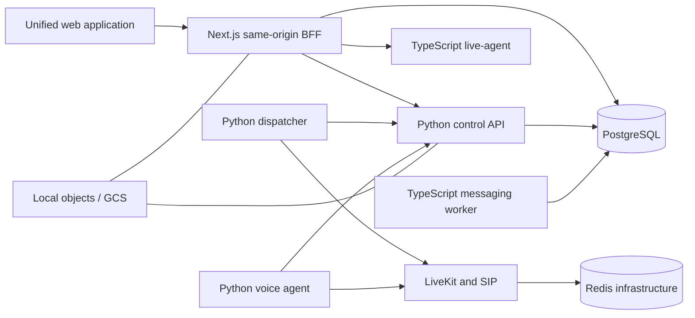

# Architecture overview

## Mission and constraints

Or-On Platform is one product assembled from three proven systems through thin
adapters and canonical contracts. It is a modular monolith for ordinary business
capabilities plus the few specialized processes required by runtime, media, or
lifecycle constraints.

The non-negotiable constraints are:

- PostgreSQL is the only runtime application database.
- Alembic is the only schema migration authority.
- Or-on telephony remains Python/FastAPI/LiveKit/Pipecat.
- OpenLive browser media remains local and its agent runtime remains TypeScript,
  Hono, WebSocket, ACP, and MCP based.
- WACRM CRM and WhatsApp behavior is adapted behind the unified BFF and workers,
  without Supabase runtime services.
- Real telephony and WhatsApp actions are denied by default.
- The target builds and runs without sibling repositories.

## System shape



PostgreSQL owns authoritative business state. Redis is permitted only for
LiveKit coordination or disposable cache. Object bytes live in a mounted local
directory during localhost development and GCS on the future VM; PostgreSQL owns
their metadata and authorization.

## Integration method

```text
proven source engine -> source-preserving adapter -> versioned platform contract
```

The platform does not replace a working engine to achieve language uniformity.
Canonical identity, contacts, agent profiles, flow graphs, and activity views are
integration seams. Specialized source records remain specialized when collapsing
them would lose lifecycle or query semantics.

## Runtime ownership

| Runtime | Responsibility | Explicitly not responsible for |
| --- | --- | --- |
| `apps/web` | Product shell, same-origin BFF, server-rendered UI, system health aggregation | Direct database access from browser code; provider secrets; background delivery loops |
| Python control API | PostgreSQL-facing control/session/tenancy integration boundary and authoritative OpenAPI | LiveKit media processing; WhatsApp fan-out |
| Python dispatcher | LiveKit webhook and call orchestration using retained Or-on behavior | CRM UI or generic job execution |
| Python voice agent | Real-time Pipecat/LiveKit voice engine | Browser-local OpenLive media |
| TypeScript live-agent | OpenLive WebSocket/ACP/provider lifecycle | Raw browser microphone transport; general CRM processing |
| TypeScript messaging worker | WhatsApp ingestion/delivery, automations, campaigns, durable jobs | HTTP product shell or telephony media |

## Architectural layers

New backend modules use this dependency direction where it creates a useful
boundary:

```text
domain -> application -> ports -> adapters -> entrypoints
```

Domain/application code cannot directly import HTTP frameworks, PostgreSQL
drivers, cloud SDKs, or provider SDKs. Existing Or-on package direction is
preserved when those packages are imported later; Phase 1 does not rename or
reimplement them.

## Current implementation boundary

Phase 1 implements foundations only: configuration, health/readiness, contract
generation, PostgreSQL/Alembic connectivity, web shell, design tokens, service
process lifecycles, verification, and documentation. CRM, WhatsApp, telephony,
Live Lab, final authentication, canonical flow execution, and final agent-profile
persistence remain later-phase work.

See [the ADR index](../adr/README.md) for decisions and
[runtime-topology.md](runtime-topology.md) for process/dependency detail.
