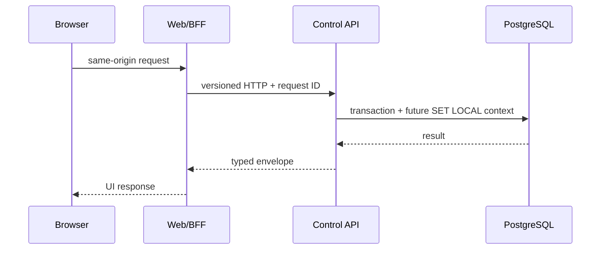

# Runtime topology

## Process model

The platform uses a modular product application plus five specialized processes.
This is the maximum planned topology, not a requirement that every process run in
Phase 1.

| Process | Runtime | Lifecycle reason | Phase 1 behavior |
| --- | --- | --- | --- |
| Unified web/BFF | Node.js / Next.js | Browser-facing UI and same-origin server APIs | Product shell, system page, control-api health consumption |
| Control API | Python / FastAPI | Preserves Or-on control/session/tenancy direction and owns Python OpenAPI | Liveness, PostgreSQL readiness, typed config, OpenAPI |
| Dispatcher | Python | LiveKit webhooks and per-call orchestration | Safe process skeleton only; no LiveKit/provider adapter |
| Voice agent | Python | Real-time Pipecat/LiveKit media lifecycle | Safe worker skeleton only; no call path |
| Live agent | Node.js / Hono / WebSocket | OpenLive ACP/provider child-process lifecycle | Liveness/readiness and protocol placeholder, not the full live protocol |
| Messaging worker | Node.js | Durable WhatsApp/automation/campaign work | Worker lifecycle/readiness skeleton; no provider adapter |

No new process is added without an ADR demonstrating a lifecycle, isolation,
scaling, native dependency, or fault-domain need.

## Health semantics

HTTP services expose:

- `GET /health/live`: process event loop is alive. It does not imply dependencies
  or providers are ready.
- `GET /health/ready`: mandatory dependencies are reachable and the process may
  safely accept intended traffic.

The control API treats PostgreSQL as mandatory, so readiness returns an unhealthy
status when a simple database probe fails. Optional provider unavailability is
reported separately and does not make a Phase 1 process crash. Workers expose an
in-process health snapshot and exit non-zero when their mandatory bootstrap fails;
an HTTP server is not added solely for symmetry.

## Local ports

| Port | Owner | Exposure |
| ---: | --- | --- |
| 3000 | Unified web | loopback development |
| 8000 | Control API | loopback development; private in Compose |
| 8080 | Future dispatcher | private/loopback |
| 8787 | Live-agent HTTP/WebSocket | private/loopback |
| 5433 -> 5432 | PostgreSQL developer access | explicitly bound to `127.0.0.1` only |
| 6379 | Future LiveKit Redis | private network only |
| 7880/7881/7882 UDP | Future LiveKit | voice profile only |
| 5060 UDP, 10000-20000 UDP | Future LiveKit SIP | never part of Phase 1 core; restricted firewall/ACL |

## Request flow

Later service events are persisted in PostgreSQL inbox/outbox/job tables before
processing. `LISTEN/NOTIFY` may wake a worker but never becomes the durable record.

## Shutdown

Every service stops accepting new work, drains bounded in-flight work, cancels
background tasks, closes network/database resources, emits a final structured log,
and exits within the orchestrator grace period. Provider actions never start during
shutdown and are disabled entirely in Phase 1.
