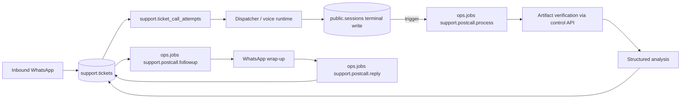

# Customer support journey

One customer issue is one ticket, from the first WhatsApp message to the last
follow-up. The record is `support.tickets`; a call, a recording, a summary, a
resolution and a wrap-up message all land on it rather than beside it.



## Three records that are easy to confuse

| Record          | What it is                                   | Relationship                          |
| --------------- | -------------------------------------------- | ------------------------------------- |
| `support.tickets` | The customer's issue across every channel  | The subject of this document          |
| `crm.tasks`     | Internal work an operator owes                | Created beside a ticket at escalation |
| `service.cases` | A field-service technician job, optional      | Linked from a ticket, never replaces it |

Nothing was renamed or migrated to introduce tickets. `/tasks` still resolves
and keeps its rows, permissions, audit history and deep links.

## What the database refuses

These are constraints, not conventions, so no worker can be convenient at their
expense:

- `resolution_classification = 'resolved'` requires a confirmation source. A
  hangup, a technically completed call and a polite thank-you are none.
- `status = 'closed'` requires a closure reason and a timestamp.
- `recording_state IN ('ready','partial')` requires an object row. The only code
  that creates one runs after the bytes were read, sized and checksummed.
- `transcript_state IN ('valid','partial')` requires the session it came from.
- `summary_state = 'ready'` requires the stored analysis that makes it ready.
- `followup_state = 'sent'` requires the message that carried it.
- `(tenant_id, attachment_key)` and `(tenant_id, job_id)` are unique, so a
  redelivered webhook opens no second ticket and no second call attempt.

## The durable post-call pipeline

A terminal write to `public.sessions` fires `support.queue_post_call_from_session`,
a `SECURITY DEFINER` trigger that enqueues one `support.postcall.process` job keyed
`support-postcall:<attemptId>`. Nothing expensive happens in Pipecat teardown or the
dispatcher's room-finalization path; the call runtime owes only its canonical
final session write and its artifacts.

The attempt's `post_call_stage` is the workflow's only authority:

```text
not_started → artifacts_pending → artifacts_verified → summary_pending
            → summary_ready → ticket_updated → followup_pending → complete
```

Every transition is an `UPDATE … WHERE post_call_stage = <expected>`. A duplicate
terminal webhook, a redelivered job, a restarted worker and a concurrent retry
all converge: whichever arrives second finds the stage already moved and does
nothing. A call that reaches a terminal status before the worker binds its
session is admitted by the binding path calling `support.enqueue_post_call`
directly, under the same key.

### Artifact verification

`GET /api/v1/voice/sessions/{id}/artifacts` reads the bytes through the same
storage abstraction the authenticated playback route uses, so a `ready` verdict
is a statement about the bytes an operator will actually hear. The recording is
parsed as a RIFF/WAVE container: 16-bit samples, a non-zero frame count, a
plausible duration. The transcript is parsed by the canonical line-per-turn
reader in `oron_sessions.verification`.

| Verdict       | Meaning                                                    |
| ------------- | ---------------------------------------------------------- |
| `ready`       | A complete, playable call recording                        |
| `partial`     | Real media shorter than a conversation — a dropped call     |
| `unavailable` | A URI with no bytes, or a valid header with no frames       |
| `failed`      | Bytes that are not a usable recording                       |

Transcript states are independent: `valid`, `partial`, `empty`, `missing`,
`failed`. Either artifact can arrive without the other, and a missing recording
never blocks the summary.

### Evidence-backed analysis

`packages/ts/crm/src/post-call-analysis.ts` holds the contract and the rules as
pure functions. The model produces candidate structure; the application decides
what survives:

- Every claim carries a source — a transcript turn index, a WhatsApp message id,
  a platform receipt or an operator note. A source that does not resolve against
  the evidence the worker loaded is dropped.
- `actionsCompleted` accepts only a platform receipt. "The agent said a
  technician would be booked" is a commitment; a `service.cases` row is a
  booking.
- Sentiment survives only with a cited turn.
- `classificationConfidence` is confidence in the classification, never in the
  customer being satisfied.

A long call is bounded deterministically: the opening turns and the closing
turns are kept with an explicit gap, because the issue is stated at the start and
the resolution exchange is at the end, and turn numbers are preserved so a
citation keeps its meaning.

### Resolution

`decideTicketResolution` is deterministic and conservative:

| Situation                                              | Outcome                                |
| ------------------------------------------------------ | -------------------------------------- |
| Call not answered, busy, failed or disconnected        | `unresolved`                           |
| Customer confirmed on the call, cited to a real turn   | `resolved`, confirmed by `customer`    |
| An authoritative receipt completed the request         | `resolved`, `authoritative_evidence`   |
| Fix proposed, customer did not confirm                 | `proposed_fix_awaiting_confirmation`   |
| Customer asked for a person                            | `unresolved`, handling `human`         |
| Analysis unavailable, or a resolution with no evidence | the safer state                        |

A resolution confirmed on the call is recorded and the ticket stays open, because
the wrap-up is about to give the customer a chance to disagree. Closing before
asking would decide the answer in advance.

## WhatsApp wrap-up and the reply

The wrap-up is its own job, so a messaging failure cannot undo a correctly
analysed call. Before sending it re-checks consent and opt-out, then goes through
the canonical outbound admission path with all of its existing rules. The text is
written by the repository in the customer's language, following the same
invariant the WhatsApp agent already follows: the model may choose what to say,
the repository supplies the words that get delivered.

A telephone call does not open or extend the WhatsApp customer-service window.
Outside it Meta permits only an approved template; with none configured, the
honest outcome is a recorded `blocked_window` an operator can act on, not a
message the provider would reject.

The message offers three numbered choices, and `classifyCustomerReply` reads them
deterministically in Hebrew and English. An unclear reply leaves the ticket
exactly as it was and falls through to the ordinary conversation — a customer
raising a new problem in the same thread must never be read as an answer about
the old one.

## Honest metrics

```text
confirmed AI-only resolution rate
  = tickets confirmed resolved with no human takeover
  ÷ eligible AI-handled tickets opened in the window
```

The window, the denominator and the policy version travel with the numbers.
Only duplicates and cancellations are excluded, because they were never support
outcomes. Reopenings are reported beside the resolutions rather than netted off,
and an empty window reports "no tickets" rather than 0%.

## Local verification

Set `CROSS_CHANNEL_TEST_DATABASE_URL` to an explicit **localhost test
PostgreSQL** migration connection with permission to create disposable
databases, then run:

```sh
pnpm --filter @or-on/crm build
pnpm --filter @or-on/messaging-worker exec vitest run \
  tests/support-tickets.live.test.ts tests/post-call.live.test.ts
```

Each suite migrates and seeds a new UUID-named database and drops it in
teardown. No provider, carrier or telephone is reachable.
