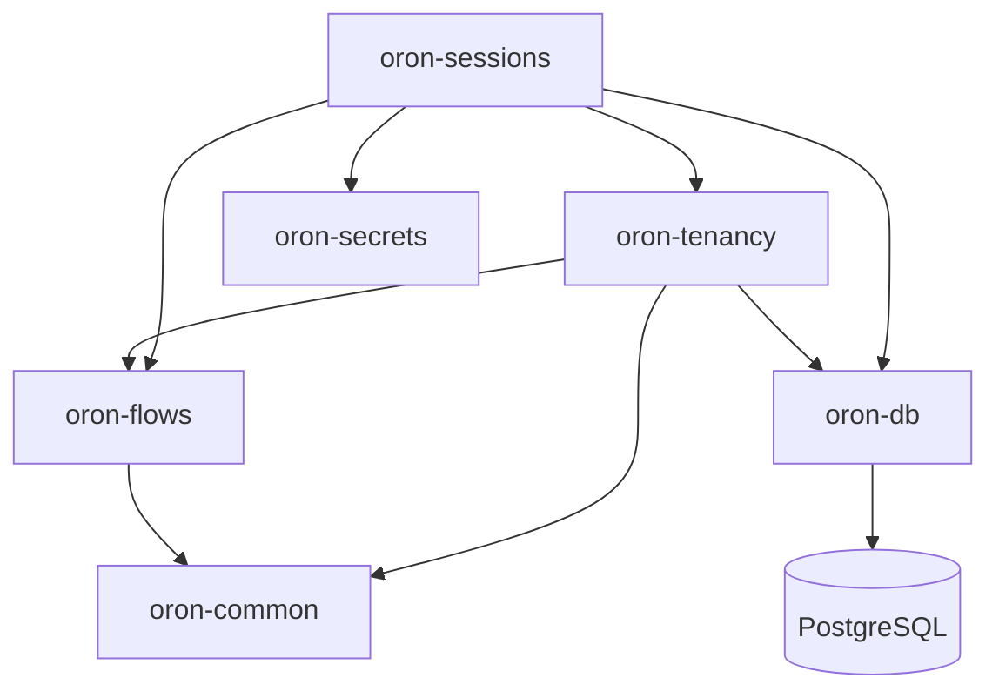

# Retained telephony package boundaries

Phase 5 preserves the locked Or-on Python package identities and integrates them
in dependency order. These packages are now copied into the target repository;
no build or runtime import reaches `../or-on`.

## Preserved behavior

- `oron-tenancy` retains tenant, phone-number, immutable flow-store, SIP
  admission/reconciliation, membership, and control-plane models.
- `oron-secrets` retains the GCP Secret Manager reference adapter. Explicit
  environment values still win, and tests use an injected fake client only.
- `oron-sessions` retains encrypted call sessions, blind indexes, artifacts,
  campaign claiming/retry behavior, contact-file parsing, the session client,
  stale-session sweeping, and API models.
- Alembic remains the only schema authority. No package calls `create_all` or
  introduces a second migration runner.

## Required target adaptations

- The tenancy runtime model now maps external identities to canonical
  `platform.identity_bindings(provider, provider_subject)` rather than the
  historical Firebase-specific binding. Historical `user_identities` remains in
  preserved Alembic lineage only.
- Membership roles are the canonical `viewer`, `agent`, `admin`, `owner` order.
  The database compatibility functions continue translating historical
  `editor` values during migration.
- The retained `ApiKey` model includes the canonical scoped-key columns added by
  Phase 4. Browser/API-key authorization continues through the canonical
  PostgreSQL function; the legacy control-plane bearer dependency is not an
  approved public boundary and will be replaced when routes are mounted.
- LiveKit API credentials, field-encryption material, blind-index keys, KMS
  wrapped keys, database-role passwords, and outbound service tokens are typed
  as redacted secrets.
- SIP provisioning and construction of the outbound dispatcher dialer are both
  disabled unless `ENABLE_REAL_TELEPHONY=true`. Injected fake/simulator adapters
  remain available to tests without weakening the production default.
- Logs no longer include E.164 values or raw provider exception text in the
  imported paths.

## Verification

- 97 selected provider-free tests cover secrets, configuration redaction,
  default-off safety, SIP request construction with an injected fake, admission
  reconciliation, identity/model shape, encryption, contact parsing, session
  models, and HTTP client behavior.
- The full Python suite passes with live PostgreSQL tests cleanly separated.
- A real PostgreSQL 18.6 run verifies all retained model columns against the
  canonical schema, canonical identity-subject uniqueness, and canonical role
  values. The complete live database suite passes 35 tests.
- Ruff, Pyrefly production-source checking, repository dependency guards, and
  package imports pass.

## Canonical API boundary

P5-007 exposes the first retained capability as a new, narrow control API
adapter rather than mounting the legacy standalone router. The versioned
`GET /api/v1/voice/sessions` endpoint uses canonical Phase 3 identity, role and
tenant claims, a generated TypeScript client, transaction-local PostgreSQL
context, and the `platform_voice` runtime role. A same-origin web BFF is the
browser boundary. The list is bounded and returns operational metadata only;
protected phone values and artifact content remain outside the contract.

P5-006 added tenant-consistent contact/campaign/object links,
provider/request idempotency, and append-only session events at Alembic head
`e24340ce81c8`.

P5-008 adds a development-only simulator command that never resolves a phone
number or constructs a LiveKit/SIP adapter. One PostgreSQL transaction writes a
terminal retained session, six ordered lifecycle records, six durable outbox
events, and one safe audit record. A tenant-scoped deterministic session ID plus
the database idempotency constraint makes replay return the same logical call.
The real-action guard independently requires both
`ENABLE_REAL_TELEPHONY=true` and explicit per-action approval, while no real
adapter is reachable from this endpoint. No telephone call, LiveKit/SIP
mutation, model download, or provider request is a claim of this checkpoint.
