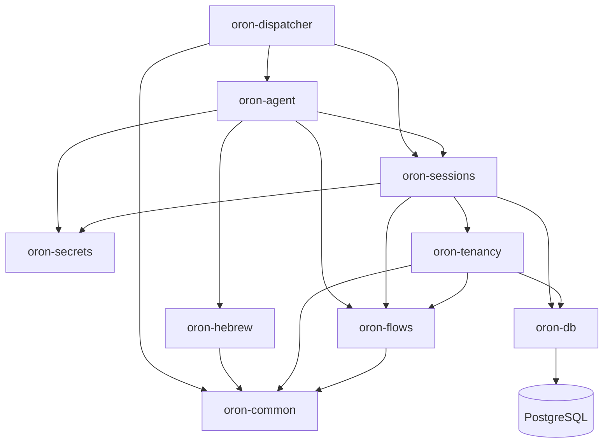

# Retained telephony package boundaries

Phase 5 preserves the locked Or-on Python package identities and integrates them
in dependency order. These packages are now copied into the target repository;
no build or runtime import reaches `../or-on`.

## Preserved behavior

- `oron-tenancy` retains tenant, phone-number, immutable flow-store, SIP
  admission/reconciliation, membership, and control-plane models.
- `oron-secrets` retains the GCP Secret Manager reference adapter. Explicit
  environment values still win, and tests use an injected fake client only.
- `oron-sessions` retains encrypted call sessions, blind indexes, artifacts,
  campaign claiming/retry behavior, contact-file parsing, the session client,
  stale-session sweeping, and API models.
- `oron-dispatcher` retains signed LiveKit webhook handling, fail-closed DID
  admission, one-agent-per-room coordination, browser rooms, active-call
  diagnostics, hangup/finalization, and the outbound LiveKit SIP adapter.
- `oron-hebrew` retains Hebrew normalization, niqqud, number handling, audio
  gender classification, and G2P adapters without retaining automatic model
  downloads.
- `oron-agent` retains the Pipecat/LiveKit media pipeline, STT/TTS/LLM
  composition, barge-in/turn behavior, flow handlers, lifecycle persistence,
  usage collection, and audio filtering.
- Alembic remains the only schema authority. No package calls `create_all` or
  introduces a second migration runner.

## Required target adaptations

- The tenancy runtime model now maps external identities to canonical
  `platform.identity_bindings(provider, provider_subject)` rather than the
  historical Firebase-specific binding. Historical `user_identities` remains in
  preserved Alembic lineage only.
- Membership roles are the canonical `viewer`, `agent`, `admin`, `owner` order.
  The database compatibility functions continue translating historical
  `editor` values during migration.
- The retained `ApiKey` model includes the canonical scoped-key columns added by
  Phase 4. Browser/API-key authorization continues through the canonical
  PostgreSQL function; the legacy control-plane bearer dependency is not an
  approved public boundary and will be replaced when routes are mounted.
- LiveKit API credentials, field-encryption material, blind-index keys, KMS
  wrapped keys, database-role passwords, and outbound service tokens are typed
  as redacted secrets.
- SIP provisioning and construction of the outbound dispatcher dialer are both
  disabled unless `ENABLE_REAL_TELEPHONY=true`. Injected fake/simulator adapters
  remain available to tests without weakening the production default.
- Logs no longer include E.164 values or raw provider exception text in the
  imported paths.
- Firebase/admin-console routes and dependencies are not imported. Platform
  commands use a short-lived `dispatcher` audience assertion; LiveKit webhooks
  retain signed-body verification.
- Verified webhook envelopes are claimed through `ops.inbound_events` before
  handling. PostgreSQL uniqueness makes completed delivery replays no-ops and
  leaves failed claims retryable.
- Outbound idempotency derives a stable session/room from tenant plus request
  key. Session persistence must succeed before bot launch, and both provider
  authorization gates plus a configured trunk are checked before lifecycle
  work; the SIP adapter repeats the gate at its lowest boundary.
- Voice-model adapters accept only existing local assets whose bytes match an
  explicitly configured SHA-256. Missing or invalid assets disable the optional
  processor and never trigger a remote fetch.
- `ENABLE_REAL_VOICE_PROVIDERS=false` is a separate default-off boundary for
  LiveKit media, STT, TTS, and LLM construction. Provider credentials are
  secret-typed and diagnostics expose only redacted configured/unconfigured
  states.
- Heavy media/native dependencies are isolated in the uv `voice` group. Base
  workspace synchronization and dispatcher imports remain usable without that
  group; `voice-bootstrap` installs it without enabling providers or fetching
  models.

## Verification

- 97 selected provider-free tests cover secrets, configuration redaction,
  default-off safety, SIP request construction with an injected fake, admission
  reconciliation, identity/model shape, encryption, contact parsing, session
  models, and HTTP client behavior.
- The full Python suite passes with live PostgreSQL tests cleanly separated.
- A real PostgreSQL 18.6 run verifies all retained model columns against the
  canonical schema, canonical identity-subject uniqueness, and canonical role
  values. The complete live database suite passes 35 tests.
- Ruff, Pyrefly production-source checking, repository dependency guards, and
  package imports pass.

## Canonical API boundary

P5-007 exposes the first retained capability as a new, narrow control API
adapter rather than mounting the legacy standalone router. The versioned
`GET /api/v1/voice/sessions` endpoint uses canonical Phase 3 identity, role and
tenant claims, a generated TypeScript client, transaction-local PostgreSQL
context, and the `platform_voice` runtime role. A same-origin web BFF is the
browser boundary. The list is bounded and returns operational metadata only;
protected phone values and artifact content remain outside the contract.

P5-006 added tenant-consistent contact/campaign/object links,
provider/request idempotency, and append-only session events at Alembic head
`e24340ce81c8`.

P5-008 adds a development-only simulator command that never resolves a phone
number or constructs a LiveKit/SIP adapter. One PostgreSQL transaction writes a
terminal retained session, ordered lifecycle records, matching durable outbox
events, and one safe audit record. A tenant-scoped deterministic session ID plus
the database idempotency constraint makes replay return the same logical call.
The real-action guard independently requires both
`ENABLE_REAL_TELEPHONY=true` and explicit per-action approval, while no real
adapter is reachable from this endpoint. No telephone call, LiveKit/SIP
mutation, model download, or provider request is a claim of this checkpoint.

P5-009 adds the retained dispatcher package and HTTP contract without yet
wiring the Pipecat voice-agent launcher. The service therefore reports not
ready until P5-010 injects that engine. Signed fixture, tamper rejection,
service-audience/capability, DID rejection, persistence-failure, idempotency,
trunk, and default-off tests run without contacting LiveKit or SIP. Alembic head
`315710614ae5` grants `platform_voice` only the select/insert/update privileges
needed on the existing webhook ledger; it receives no job authority or delete
privilege.

P5-012 through P5-017 mount the retained data and flow engines behind the same
canonical boundary. Alembic head `7beb64e1ff33` adds explicit CRM voice consent
and normalized voice-campaign policy fields while preserving historical
campaign rows. Simulator DID registration requires a published flow and a
restricted ACL; reconciliation never mutates provider state. Flow versions are
validated and immutable, campaigns select only eligible opted-in contacts, and
session detail exposes ordered transcript/outcome/usage/latency events plus
object metadata references. Every mutation writes safe audit metadata without
phone, transcript, credential, or provider payload content.

The authenticated unified shell now owns `/voice`, `/voice/calls/[id]`,
`/voice/campaigns`, and `/flows`, plus the consent-gated contact simulator
action. These replace the Phase 5 operator use cases without copying the
standalone console. The Phase 7 cross-channel compiler remains explicitly
deferred.

P5-010 imports the retained Hebrew and Pipecat agent packages and supplies a
target launcher adapter. The launcher owns exactly one asyncio task per call,
validates overrides, supports cancellation, and performs the provider preflight
before it creates a task. Dispatcher composition injects it explicitly; the
default-off integration test proves an admitted call is recorded as failed
without creating provider work. The provider-free retained suite passes 349
tests with three deployment-wiring cases explicitly deferred to P5-011. No
model asset was downloaded, bundled, or executed, and no real provider was
contacted.

P5-011 adds a separate opt-in Compose profile using digest-pinned Redis 8.10.1,
LiveKit Server v1.13.6, and LiveKit SIP v1.13.0. All three container health
checks pass and a read-only SDK probe lists inbound trunks, outbound trunks, and
dispatch rules successfully. Redis and SIP have no host port bindings; the
LiveKit control endpoint is loopback-only. The verified initial state contained
zero trunks and zero rules, and no create/dial/provider operation ran. The
provider-enabled agent and dispatcher runtime remain host/service integration
work after the P5-012 admission boundary is complete.
