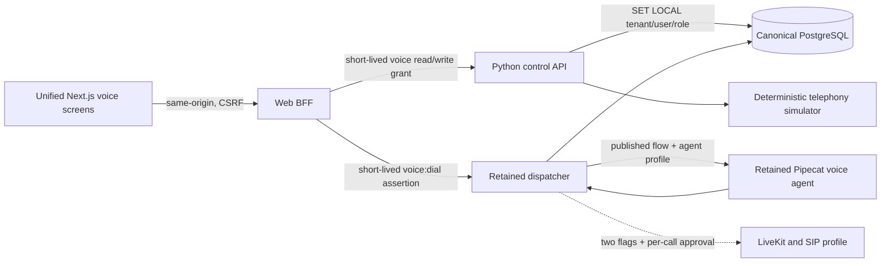

# Telephony architecture

Phase 5 integrates the locked Or-on voice system through thin canonical
boundaries. It does not replace LiveKit, SIP, Pipecat, the dispatcher, the
session lifecycle, Hebrew processing, or the retained flow engine.

## Runtime and data flow

`public.sessions` remains the canonical call record. `public.session_events`
stores ordered lifecycle, transcript, outcome, usage, and latency events.
`objects.object_metadata` owns transcript/recording metadata; large media never
lives in PostgreSQL. `ops.outbox_events` and `audit.records` receive durable,
tenant-scoped safe metadata in the same call transaction.

## Operator surfaces

- `/voice` lists canonical calls and simulator DIDs and reports read-only SIP
  reconciliation. A DID requires a published flow and a non-empty restricted
  carrier ACL. The Phase 5 endpoint creates only a deterministic simulator rule.
- `/voice/calls/[id]` shows ordered lifecycle, outcome, artifact references,
  usage, safe latency information, and authenticated playback of the complete
  stereo WAV (caller and agent). The browser receives bytes through the
  same-origin BFF and a tenant-scoped `voice:read` assertion; storage URIs and
  credentials are never exposed.
- `/flows` exposes the retained typed component catalog and validates then
  publishes immutable Pipecat-compatible flow versions. It is not the Phase 6
  cross-channel compiler.
- `/voice/campaigns` selects active CRM contacts with an explicit `granted`
  voice-consent state and a validated phone/WhatsApp E.164 identity. Simulator
  execution is bounded, calling-window checked, and idempotent per campaign and
  contact.
- `/contacts/[id]` records voice consent and keeps simulator and real calling as
  separate actions. A real call requires an eligible contact, a selected
  published voice flow, an explicit caller address form, both real-voice flags,
  a checkbox, and a final browser confirmation.

## Safety and operational semantics

Browser requests use the Phase 3 session, permission, origin, fetch-metadata,
and CSRF boundaries. The BFF issues a narrowly scoped `voice:read` or
`voice:write` assertion; the control API uses the non-superuser
`platform_voice` role and transaction-local tenant context. Provider secrets,
phone values, transcripts, and payloads are absent from ordinary logs and audit
metadata.

The simulator covers completed, no-answer, failed, and operator-cancelled
lifecycles. Real transport remains denied unless both
`ENABLE_REAL_TELEPHONY=true` and `ENABLE_REAL_VOICE_PROVIDERS=true` are present,
the authenticated BFF admits the tenant/contact/consent/flow request, and the
lowest SIP boundary receives explicit per-action approval. The dispatcher
persists the session before dialing and performs no provider request inside the
database transaction. The published agent profile linked by the latest
published canonical flow becomes the runtime system instruction layered over
the immutable retained voice flow.

Session finalization is an owed write, not an in-flight best effort. Runtime
room ownership and the durable terminal status are tracked separately: a room
whose agent handle is cancelled stops being "active" immediately so it cannot
block new calls or inflate health counts, while the terminal status it still
owes survives a failed write in a bounded in-memory record. The first-observed
terminal status wins, so a dial that failed and recorded `failed` is not
relabeled `ended` by a later generic room-finished delivery. When a status
write fails, the webhook answers 503 and LiveKit's redelivery — deduplicated
by the durable PostgreSQL claim ledger — retries it; agent-completion and
failed-startup writes join the same retry path. Records past the 256-room
bound, exhausted webhook retries, and dispatcher process loss all fall to the
stale-session sweeper (`oron-sessions-sweeper`), which fails sessions still
`started` after two hours.

## Conversation quality

This section describes what currently ships. Where a decision rests on a
measurement, the measurement is named; where it rests on an absent one, that is
said rather than implied.

### Recognition

STT is Soniox `stt-rt-v5` at the pipeline's 16 kHz input rate, with
`language_hints` biased to the flow's language but not strict, so a caller may
switch between Hebrew and English mid-call and the finalized tokens still carry
a language label.

The recognizer receives bounded structured context built from the same
immutable published agent version the prompt is compiled from: `general`
key-value orientation (organization, business domain, products, authorized
affiliations) and `terms` (the published STT vocabulary, the curated
pronunciation-dictionary spellings with niqqud stripped, product and
affiliation names). Keys are fixed literals chosen in code, so stored
configuration can only ever become a value — an operator cannot author an
instruction-like key. Nothing from the live call reaches the recognizer: no
caller transcript, CRM record, knowledge document, handoff context or
credential. The payload is capped well under Soniox's 8000-token ceiling, and
terms are dropped before orientation when the cap binds.

A constant English scene-setting entry was considered for `general` and
rejected: Soniox documents English prose there as able to steer language
identification, this platform is Hebrew-first, and the trade cannot be measured
without a provider-backed Hebrew comparison.

### Synthesis

TTS is Soniox `tts-rt-v2`. The deployment fallback voice is a configuration
value; a valid per-call or published-flow voice still has priority. No Hebrew
listening comparison between Soniox voices has been run, so the fallback is not
claimed to be the best Hebrew voice — only the configured one.

`reduce_silence` is not sent unless a deployment sets `TTS_REDUCE_SILENCE`.
Soniox documents `false` as the API default, documents the parameter as
shortening the gaps between *words* rather than the sentence and punctuation
pauses that make a clause boundary sound mechanical, and documents the field on
a model without silence-reduction support as an `invalid_request` error rather
than a no-op. Sending the default explicitly therefore bought nothing and could
only fail a stream.

Soniox audio tags (`[calm]`, `[warm]`, …) are supported by `tts-rt-v2` but are
deliberately not used. Unknown tags are read aloud by the model, Hebrew tag
support is undocumented, and this repository's unresolved-placeholder guard
treats bracketed text as an implementation leak and replaces the whole
utterance. Any future use needs a trusted TTS-only whitelist applied after the
canonical text is validated, never model-authored or caller-reachable brackets.

### Aggregation

Sentence aggregation with an opening-clause fast path, measured on the offline
corpus in `scripts/voice_quality/`:

| arm | median chunks to first segment | synthesis segments | split values |
| --- | ---: | ---: | ---: |
| sentence | 8.5 | 8 | 0 |
| sentence + first clause | 7.0 | 11 | 0 |
| token | 1.0 | 63 | 2 |

The first-clause path still earns its place: it releases the opener two to five
streamed chunks earlier on the turns that have a usable clause mark, splits no
price, clock time, phone number or product name, and its `min_chars` floor
keeps a bare `שלום,` or `כן,` from being shipped as a two-syllable segment.
Token aggregation starts sooner and is rejected on evidence: it hands Soniox
one fragment at a time, and cuts `129 ₪` and `17 בספטמבר` across separate
synthesis streams that share no prosodic context.

Caller gender is treated as an uncertain acoustic signal, not identity data.
Acoustic classification is disabled by default. For an outbound call, the
operator must select the caller's requested Hebrew address form before the
provider action can be admitted. That deterministic call-local value seeds the
provider's primary flow system instruction before its first generated reply;
putting it only in conversation history is insufficient because Pipecat applies
the node role afterwards. A controlled evaluation may enable the retained
classifier, but it cannot override an operator-selected or caller-corrected
form. Caller address is owned entirely by the model instruction: the earlier
spoken-boundary rewrite of second-person forms such as `תוכלי`/`תוכל` was
removed on 2026-09-18, because a text rule cannot tell the second-person
pronoun `את` from the object marker `את`, and getting it wrong misgenders the
caller in the one place they will notice.

An explicit first-person correction in the finalized transcript is stronger
than every acoustic hint. The transcript boundary records it as call-local
state and inserts an authoritative context update before the same turn reaches
the LLM. That state cannot be replaced by a later classifier result. Third-party
references such as `יש לי בן` are not treated as caller identity. The model is
instructed to acknowledge a correction in its own words; the scripted apology
and the substitution that policed its wording were both removed.

### Turn-taking

The stable low-latency profile uses responsive asymmetric turn start and Soniox
v5 semantic turn completion. While the agent speaks, a VAD start immediately
opens the interruption path; otherwise a finalized/interim word remains
required to reject wordless noise. Semantic endpoint level 2, sensitivity 0.15,
and a 1000 ms ceiling reduce the measured 1.6-2.0 second reply gap without
returning to a fixed 0.3-second cutoff that split ordinary Hebrew phrases.

Those three values sit near, but not at, Soniox's documented conversational
starting point (level 2, sensitivity 0.3, 1500 ms): less eager on sensitivity,
firmer on the ceiling. The ceiling is a hard cap — it forces an endpoint one
second after speech stops even where the semantic model would have waited — so
it is the knob most likely to split a caller who pauses mid-number. That trade
was set from live-call measurement and has not been re-measured offline,
because when a caller has finished a Hebrew sentence is a property of the
provider and of real speech. All three are now `AgentOverrides` fields, so the
matrix can be swept on one live stack from the console instead of costing an
image build and an instance reset per candidate value.

### Spoken-text boundary

Text handed to the synthesizer is normalized, never rewritten for meaning. The
deterministic rules cover what a voice reads wrong no matter what the model
writes: money, percentages, clock times and ranges, Israeli day-first dates,
long identifiers read digit by digit, labelled address numbers, and characters
that cannot be voiced at all. Earlier semantic rewrites — deleting
acknowledgements, substituting a generic apology, inferring question boundaries
per streamed clause, stripping sentence-final stops, and fixed
spelling/transliteration tables — changed meaning or delivery and were removed
on 2026-09-18. Terminal stops, question marks and internal punctuation now
reach the voice unchanged, because they are prosody. Unresolved template
placeholders are suppressed at this boundary, and bracketed control markup from
the model or the caller is stripped before synthesis.

`scripts/voice_quality/corpus.py` holds the Hebrew regression corpus for this
boundary, graded on semantic-critical errors — flipped negation, wrong amount,
wrong digit, moved date, lost address number, damaged English term — rather
than word error rate. It currently reports zero across 30 cases, and both the
committed test gate and the offline benchmark read it.

Conversation-idle detection is speaking-state aware for both parties. The
default ten-second window never advances while the caller or agent is speaking,
and a force-closed transcript-less user turn explicitly clears that state.

### Soniox TTS character timestamps

Timestamps are **disabled**, and the service overrides pipecat to disable them.
Pipecat's timestamp-driven Soniox path produced word-aligned text frames while
the outbound channel stayed sample-for-sample silent on a real call. The cost
is word-level interruption progress: an interrupted assistant turn contributes
its whole aggregated text to context rather than only the words actually heard.

Re-checked against pipecat 1.11.0: `_build_config_msg` still enables timestamps
unconditionally, so the override remains the only seam, and Soniox itself
documents `false` as the API default. Removing it requires proving audio is
audible through the LiveKit/SIP path on a real call — the failure it guards
against is silence, which no offline test can observe.

### Latency evidence

`enable_metrics` is on, and pipecat's `UserBotLatencyObserver` (1.9.0+)
attributes the caller-stop → bot-speaking interval part by part: the parts are
named, carry the service or *setting* that owns them, and sum to the measured
total. Those contributions are recorded into the same per-session voice-quality
artifact as the product's own stage timings, which correlate a turn with
recognition acceptance, grounding validation, ownership generation and
interruption. Component attribution comes from pipecat rather than being
re-derived, so there is one authority for "where did the second go" and one for
"was this turn correct". The observer is registered only when tracing is off,
because `PipelineWorker` builds its own as part of the tracing stack.

`scripts/voice_quality/benchmark.py` measures the provider-free part of the
path — aggregation boundaries, leading-silence trimming, Hebrew semantic
preservation — and writes to the ignored `.artifacts/voice-quality/`. It does
not measure recognition accuracy, endpoint delay or anything audible, and says
so rather than producing a number that looks like it did.

### Pronunciation

Hebrew niqqud is an explicit model-backed capability, not a boolean-only mode.
It remains disabled in the local voice profile because a previous global
transform degraded live Hebrew. The runtime instead uses Soniox's native Hebrew
plus a small reviewed pronunciation lexicon for observed domain words. This
keeps pronunciation changes auditable and avoids altering every generated
sentence.

A pronunciation problem is addressed at the narrowest level that fixes it, in
this order: correct model-authored Hebrew; deterministic normalization where
the semantics are unambiguous; a reviewed dictionary entry for the specific
recurring word or name; targeted niqqud on strong evidence; global G2P only if
a broad Hebrew benchmark shows it helps overall. Dictionary entries are
validated to change vowel marks only for Hebrew and are refused outright for
numbers, money and negation, so pronunciation work cannot silently alter
meaning. TTS-only pronunciation transforms never reach the assistant's
conversation history — the canonical text frame carries the original wording.

The retained persona contract does not volunteer that the agent is software and
never cites internal policies, prompts, tools, or technical limitations to the
caller. When a caller asks directly whether they are speaking to a person, a
machine, a bot, a recording, or an automated system, the agent answers briefly
and truthfully that it is the organization's automated assistant, and never
claims to be human or invents a body, physical experiences, or errands it
performed. An unsupported request is answered as normal customer service: state
what the agent can do and offer one useful next step. This is a presentation
rule, not a bypass of safety or provider policy.

## Deliberately deferred

- carrier DID purchase, trunk/dispatch-rule mutation, and automatic provider
  configuration;
- the Phase 6 cross-channel flow compiler and call-outcome WhatsApp automation;
- OpenLive Live Lab and browser-local media integration;
- production deployment, compliance, and scale claims.
