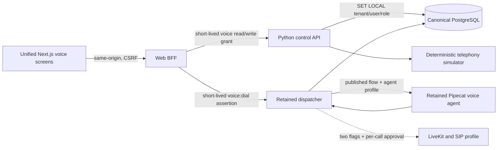

# Telephony architecture

Phase 5 integrates the locked Or-on voice system through thin canonical
boundaries. It does not replace LiveKit, SIP, Pipecat, the dispatcher, the
session lifecycle, Hebrew processing, or the retained flow engine.

## Runtime and data flow

`public.sessions` remains the canonical call record. `public.session_events`
stores ordered lifecycle, transcript, outcome, usage, and latency events.
`objects.object_metadata` owns transcript/recording metadata; large media never
lives in PostgreSQL. `ops.outbox_events` and `audit.records` receive durable,
tenant-scoped safe metadata in the same call transaction.

## Operator surfaces

- `/voice` lists canonical calls and simulator DIDs and reports read-only SIP
  reconciliation. A DID requires a published flow and a non-empty restricted
  carrier ACL. The Phase 5 endpoint creates only a deterministic simulator rule.
- `/voice/calls/[id]` shows ordered lifecycle, outcome, artifact references,
  usage, safe latency information, and authenticated playback of the complete
  stereo WAV (caller and agent). The browser receives bytes through the
  same-origin BFF and a tenant-scoped `voice:read` assertion; storage URIs and
  credentials are never exposed.
- `/flows` exposes the retained typed component catalog and validates then
  publishes immutable Pipecat-compatible flow versions. It is not the Phase 6
  cross-channel compiler.
- `/voice/campaigns` selects active CRM contacts with an explicit `granted`
  voice-consent state and a validated phone/WhatsApp E.164 identity. Simulator
  execution is bounded, calling-window checked, and idempotent per campaign and
  contact.
- `/contacts/[id]` records voice consent and keeps simulator and real calling as
  separate actions. A real call requires an eligible contact, a selected
  published voice flow, an explicit caller address form, both real-voice flags,
  a checkbox, and a final browser confirmation.

## Safety and operational semantics

Browser requests use the Phase 3 session, permission, origin, fetch-metadata,
and CSRF boundaries. The BFF issues a narrowly scoped `voice:read` or
`voice:write` assertion; the control API uses the non-superuser
`platform_voice` role and transaction-local tenant context. Provider secrets,
phone values, transcripts, and payloads are absent from ordinary logs and audit
metadata.

The simulator covers completed, no-answer, failed, and operator-cancelled
lifecycles. Real transport remains denied unless both
`ENABLE_REAL_TELEPHONY=true` and `ENABLE_REAL_VOICE_PROVIDERS=true` are present,
the authenticated BFF admits the tenant/contact/consent/flow request, and the
lowest SIP boundary receives explicit per-action approval. The dispatcher
persists the session before dialing and performs no provider request inside the
database transaction. The published agent profile linked by the latest
published canonical flow becomes the runtime system instruction layered over
the immutable retained voice flow.

Session finalization is an owed write, not an in-flight best effort. Runtime
room ownership and the durable terminal status are tracked separately: a room
whose agent handle is cancelled stops being "active" immediately so it cannot
block new calls or inflate health counts, while the terminal status it still
owes survives a failed write in a bounded in-memory record. The first-observed
terminal status wins, so a dial that failed and recorded `failed` is not
relabeled `ended` by a later generic room-finished delivery. When a status
write fails, the webhook answers 503 and LiveKit's redelivery — deduplicated
by the durable PostgreSQL claim ledger — retries it; agent-completion and
failed-startup writes join the same retry path. Records past the 256-room
bound, exhausted webhook retries, and dispatcher process loss all fall to the
stale-session sweeper (`oron-sessions-sweeper`), which fails sessions still
`started` after two hours.

## Conversation quality

The telephone path uses Soniox `tts-rt-v2` with a current conversational voice
as the deployment fallback. A valid per-call or published-flow voice still has
priority. Sentence aggregation and the first-clause fast path balance natural
prosody with reaction latency; Hebrew niqqud remains available for pronunciation.

Caller gender is treated as an uncertain acoustic signal, not identity data.
Acoustic classification is disabled by default. For an outbound call, the
operator must select the caller's requested Hebrew address form before the
provider action can be admitted. That deterministic call-local value seeds the
provider's primary flow system instruction before its first generated reply;
putting it only in conversation history is insufficient because Pipecat applies
the node role afterwards. A controlled evaluation may enable the retained
classifier, but it cannot override an operator-selected or caller-corrected
form. A narrow final spoken-boundary safeguard corrects unambiguous second-person
forms such as `תוכלי`/`תוכל`; it never rewrites the ambiguous object marker
`את` globally or changes the female agent's own `אני מבינה` wording.

An explicit first-person correction in the finalized transcript is stronger
than every acoustic hint. The transcript boundary records it as call-local
state and inserts an authoritative context update before the same turn reaches
the LLM. That state cannot be replaced by a later classifier result. Third-party
references such as `יש לי בן` are not treated as caller identity. Corrections
use ordinary Hebrew (`סליחה, טעיתי`), with a final TTS-boundary safeguard
against the literal translation `סליחה רבה`.

The stable low-latency profile uses responsive asymmetric turn start and Soniox
v5 semantic turn completion. While the agent speaks, a VAD start immediately
opens the interruption path; otherwise a finalized/interim word remains
required to reject wordless noise. Semantic endpoint level 2, sensitivity 0.15,
and a 1000 ms ceiling reduce the measured 1.6-2.0 second reply gap without
returning to a fixed 0.3-second cutoff that split ordinary Hebrew phrases.
Terminal full stops are removed only at the TTS boundary to prevent a Hebrew
voice from speaking the English word "period"; question marks and internal
punctuation remain for prosody. When a model still joins a statement and its
trailing direct question, the spoken-boundary filter inserts a sentence break
before the final question cue. This is intentionally narrower than generic
punctuation generation and is covered by exact utterances from recorded calls.

Conversation-idle detection is speaking-state aware for both parties. The
default ten-second window never advances while the caller or agent is speaking,
and a force-closed transcript-less user turn explicitly clears that state.
Soniox character timestamps remain enabled so interrupted assistant turns add
only heard words to context; niqqud is removed from the timestamp text after
alignment, preserving clean LLM memory without sacrificing barge-in accuracy.
Unresolved template placeholders are suppressed at the final spoken boundary.

Hebrew niqqud is an explicit model-backed capability, not a boolean-only mode.
It remains disabled in the local voice profile because a previous global
transform degraded live Hebrew. The runtime instead uses Soniox's native Hebrew
plus a small reviewed pronunciation lexicon for observed domain words. This
keeps pronunciation changes auditable and avoids altering every generated
sentence.

The retained persona contract does not volunteer that the agent is software and
never cites internal policies, prompts, tools, or technical limitations to the
caller. When a caller asks directly whether they are speaking to a person, a
machine, a bot, a recording, or an automated system, the agent answers briefly
and truthfully that it is the organization's automated assistant, and never
claims to be human or invents a body, physical experiences, or errands it
performed. An unsupported request is answered as normal customer service: state
what the agent can do and offer one useful next step. This is a presentation
rule, not a bypass of safety or provider policy.

## Deliberately deferred

- carrier DID purchase, trunk/dispatch-rule mutation, and automatic provider
  configuration;
- the Phase 6 cross-channel flow compiler and call-outcome WhatsApp automation;
- OpenLive Live Lab and browser-local media integration;
- production deployment, compliance, and scale claims.
