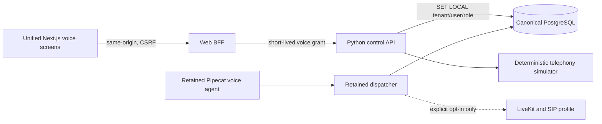

# Telephony architecture

Phase 5 integrates the locked Or-on voice system through thin canonical
boundaries. It does not replace LiveKit, SIP, Pipecat, the dispatcher, the
session lifecycle, Hebrew processing, or the retained flow engine.

## Runtime and data flow

`public.sessions` remains the canonical call record. `public.session_events`
stores ordered lifecycle, transcript, outcome, usage, and latency events.
`objects.object_metadata` owns transcript/recording metadata; large media never
lives in PostgreSQL. `ops.outbox_events` and `audit.records` receive durable,
tenant-scoped safe metadata in the same call transaction.

## Operator surfaces

- `/voice` lists canonical calls and simulator DIDs and reports read-only SIP
  reconciliation. A DID requires a published flow and a non-empty restricted
  carrier ACL. The Phase 5 endpoint creates only a deterministic simulator rule.
- `/voice/calls/[id]` shows ordered lifecycle, outcome, artifact references,
  usage, and safe latency information.
- `/flows` exposes the retained typed component catalog and validates then
  publishes immutable Pipecat-compatible flow versions. It is not the Phase 6
  cross-channel compiler.
- `/voice/campaigns` selects active CRM contacts with an explicit `granted`
  voice-consent state and a validated phone/WhatsApp E.164 identity. Simulator
  execution is bounded, calling-window checked, and idempotent per campaign and
  contact.
- `/contacts/[id]` records voice consent and offers a simulator call only for an
  eligible contact. It never offers a carrier fallback.

## Safety and operational semantics

Browser requests use the Phase 3 session, permission, origin, fetch-metadata,
and CSRF boundaries. The BFF issues a narrowly scoped `voice:read` or
`voice:write` assertion; the control API uses the non-superuser
`platform_voice` role and transaction-local tenant context. Provider secrets,
phone values, transcripts, and payloads are absent from ordinary logs and audit
metadata.

The simulator covers completed, no-answer, failed, and operator-cancelled
lifecycles. Real transport remains denied unless both
`ENABLE_REAL_TELEPHONY=true` and explicit per-action approval are present. No
automatic reconciliation mutates provider state. The optional Compose voice
profile exposes only loopback LiveKit control ports; Redis and SIP stay private.

## Deliberately deferred

- carrier DID purchase, trunk/dispatch-rule mutation, public SIP/RTP exposure,
  and real calls;
- the Phase 6 cross-channel flow compiler and call-outcome WhatsApp automation;
- OpenLive Live Lab and browser-local media integration;
- production deployment, compliance, and scale claims.
