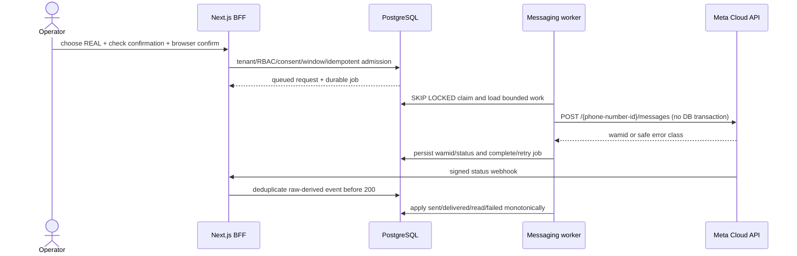

# Meta WhatsApp Cloud API delivery

Phase 6 connects the canonical messaging model to Meta without replacing the
simulator. The simulator is the default adapter. Real delivery is an explicit,
durable path owned by the messaging worker.

## Provider boundary

`WhatsAppProvider` has separate simulator and Meta implementations. The Meta
adapter uses the configured stable Graph API version and only the messages edge.
It validates strict E.164 recipients, 1–4096 character text, template names,
languages, and parameters. Requests time out after eight seconds and retry only
429, 5xx, timeout, and network failures, with bounded exponential backoff and
jitter. 400/401/403 are permanent. Error objects contain only safe status/code
metadata.

Meta Graph API `v26.0` is the selected development value as of 2026-09-02. It is
configuration rather than a source constant so expiry upgrades remain explicit.
WACRM's locked `v21.0` implementation supplied behavioral provenance but was not
copied wholesale.

## Policy and persistence

- `ENABLE_REAL_WHATSAPP=false` remains the example/default kill switch. Both BFF
  admission and the lowest Meta adapter deny when it is false.
- Real admission requires `messaging:operate`, trusted same-origin/CSRF checks,
  explicit UI confirmation, active contact state, granted WhatsApp consent, no
  opt-out, a valid E.164 WhatsApp identity, and a tenant idempotency key.
- Free-form text is admitted only before the conversation's server-maintained
  customer-service-window expiry. Every verified inbound Meta message extends it
  by 24 hours. The platform does not guess or override the window.
- Outside that window callers must choose a template name/language. Meta remains
  the approval authority and rejects unapproved or invalid templates; the
  platform does not create, approve, or disguise templates.
- `messaging.outbound_requests`, `messaging.messages`, and `ops.jobs` are written
  in one transaction. Job payloads contain only the request UUID, not bodies,
  numbers, or credentials.
- Tokens and webhook secrets exist only in the worker/web environment. Channel
  JSON contains only non-secret phone-number ID, WABA ID, and Graph version and
  has a database constraint rejecting common secret keys.

The unavoidable crash window after Meta accepts and before the worker persists
the returned wamid is documented as at-least-once ambiguity: the durable
idempotency key prevents duplicate admission/claims, but Meta's messages edge
does not expose a platform idempotency-key contract. Operational retry of an
ambiguous send must inspect Meta delivery evidence first.

## Safe outbound diagnostics (2026-09-03)

The worker records version-1 `WhatsAppSendDiagnostic` metadata in the existing
`messaging.messages.provider_payload.whatsappSendDiagnostic` JSONB key, in the
same transaction as failure/retry state. No schema migration or provider change
is needed. Other payload keys remain intact, including on non-HTTP failures;
successful retry clears the diagnostic and the existing outbound error code.

Numeric HTTP/code/subcode and a fixed reason enum are the complete contract.
The adapter inspects bounded `error.message` and `error_data.details` only to
recognize explanations such as test-template, resource-access, or app-capability
restrictions. It never persists or logs those strings, user-facing provider
titles, raw response objects, or trace strings. Unknown explanations stay unknown.
Numeric code values are validated even if Meta supplies strings; arbitrary strings
cannot become error codes or log data.

The shared CRM projection explicitly reconstructs the safe DTO instead of
spreading provider JSON. The existing tenant/RLS-protected message-page query
joins `outbound_requests` through its unique `(tenant_id, message_id)` index for
legacy codes. English/Hebrew inbox details and the structured worker log consume
this projection. No new authorization bypass, automatic resend, provider request,
or retry policy is introduced. Old errors cannot be retroactively reconstructed.

The isolated `preview_ui.py --check-messaging` gate uses PostgreSQL and the
`platform_messaging` runtime role with mocked HTTP. It verifies persistence,
secret/PII omission, tenant-scoped `platform_web` projection, permanent duplicate
processing refusal, transient exhaustion, successful retry cleanup, and that
provider requests happen outside a database transaction.

## Webhook boundary

GET verification compares `hub.verify_token` with the env-only verify token and
returns the exact challenge. POST verification computes HMAC-SHA-256 over the
exact raw request bytes using the app secret. Text and status envelopes are
stored through the existing narrow security-definer admission function, keyed by
provider account and provider event ID, before acknowledgement. The worker
deduplicates and applies `sent`, `delivered`, `read`, and `failed` statuses without
allowing late lower-ranked receipts to regress a delivered/read message.

No implementation or test subscribes the webhook or sends provider traffic.
