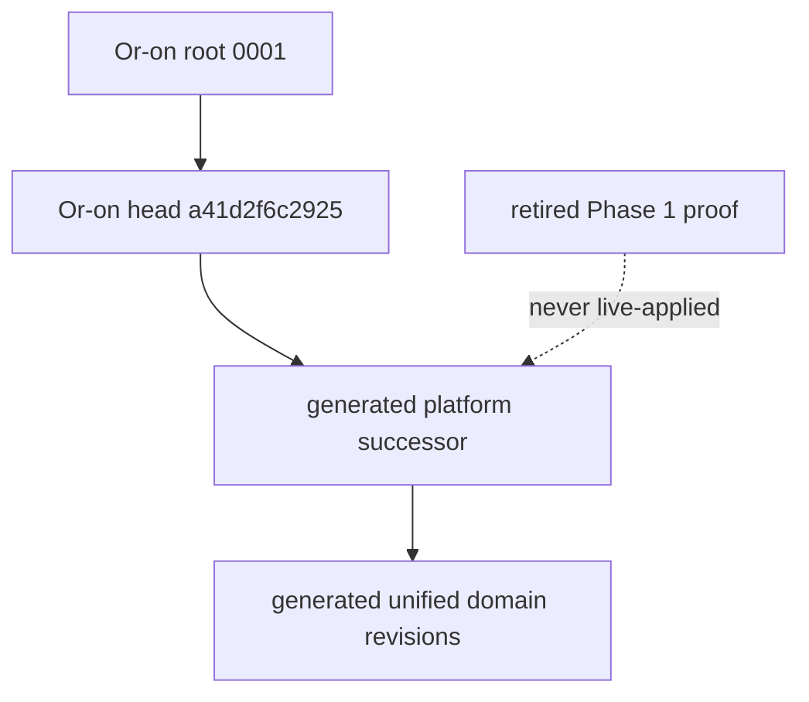

# Or-on Alembic lineage integration

## Locked source

- Repository: `../or-on`
- Commit: `cece174f4d590a1b8a283d539dd66e08cc689aa9`
- Source: `alembic/versions/`
- Revisions: 22

Mechanical metadata inspection—not filename inference—found root `0001`, branch
point `8eda5976c920`, merge revision `8aa960fd77ec`, and sole source head
`a41d2f6c2925`. All revision IDs, `down_revision` values, branch/dependency
metadata, ordering, upgrade SQL, and downgrade intent are preserved.

## Necessary target adaptations

Three historical files imported `oron_db.DbRole`. The target must build and run
without `../or-on`, so only those import lines point to
`db.alembic.oron_migration_compat.DbRole`, whose two string values exactly match
the locked source. No SQL changes.

Revision `0004` performs a live data query/backfill. Alembic offline connections
cannot return query rows, so a narrow `context.is_offline_mode()` return was
added after its schema operations. Live execution and data semantics are
unchanged; offline SQL now emits the column/index and defers the data backfill to
the real upgrade.

## Phase 1 bootstrap reconciliation

The retired revision is `0001_platform_foundation`. Repository evidence in
`docs/progress.md` states Docker/PostgreSQL was unavailable, live `alembic
upgrade`/`current` were blocked, and only deterministic offline SQL ran. There is
no repository evidence of a persistent database receiving it. It is retained in
`db/alembic/retired/` as a non-executable provenance artifact.

Its useful `platform.system_metadata` content is recreated in a new
Alembic-generated successor of `a41d2f6c2925`. Git history is not rewritten.

Fresh upgrade, data backfill, downgrade, roles, extensions, and RLS execution are
**PENDING LIVE POSTGRESQL VALIDATION — PHASE 2B**.
