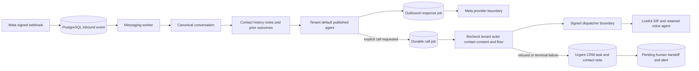

# WhatsApp AI and automatic callback runbook

This runbook covers the governed path from a signed inbound Meta WhatsApp
message to an AI response and, when the customer explicitly requests it, to a
durable automatic telephone call. Neither a webhook nor an external model
invokes the carrier directly.

## Runtime path



The webhook verifies the exact raw body before durably accepting a deduplicated
event. The worker commits the inbound message before contacting the model.
Model, Meta, dispatcher and carrier requests run outside database transactions.
Generated replies retain the consent, opt-out, E.164, customer-service-window,
idempotency, audit, tenant-RLS and provider kill-switch checks used by operator
messages.

## Configuration

Configure values only in the ignored local `.env` or deployment secret manager:

```dotenv
ENABLE_WHATSAPP_AI=true
LLM_PROVIDER=openai-compat
LLM_API_KEY=<secret>
LLM_MODEL=gemini-2.5-flash
LLM_BASE_URL=https://generativelanguage.googleapis.com/v1beta/openai/

ENABLE_REAL_WHATSAPP=true
WHATSAPP_ACCESS_TOKEN=<secret>
WHATSAPP_APP_SECRET=<secret>
WHATSAPP_WEBHOOK_VERIFY_TOKEN=<secret>
WHATSAPP_PHONE_NUMBER_ID=<meta-phone-number-id>
WHATSAPP_WABA_ID=<meta-waba-id>
WHATSAPP_GRAPH_API_VERSION=v26.0

ENABLE_REAL_TELEPHONY=false
ENABLE_REAL_VOICE_PROVIDERS=false
ENABLE_WHATSAPP_AUTO_CALLS=false
DISPATCHER_URL=http://127.0.0.1:8082
```

Keep `ENABLE_WHATSAPP_AUTO_CALLS=false` until the connected flow and real voice
path have passed their manual smoke tests. Automatic calls require real
WhatsApp, WhatsApp AI, the callback switch and both real-voice switches.
`AUTH_SERVICE_SECRET` must be shared by the messaging worker and dispatcher
through the secret manager; it is never a flow value.

Restart the web, messaging worker and dispatcher after changing environment
values. Apply the current Alembic head first. Never place secrets in prompts,
flows, documentation, logs, screenshots or support messages.

WhatsApp and voice use the same `LLM_*` configuration. Legacy `AI_API_KEY`,
`AI_MODEL`, and `AI_BASE_URL` values are not read by the platform.

## Prepare the default agent and connected flow

1. Under **Agents & Flows**, create an agent profile with both `whatsapp` and
   `voice` channels, a customer-safe prompt and the intended locale.
2. Publish the profile. Draft profiles cannot answer customers.
3. Select **Use for new WhatsApp conversations** if it is not already marked as
   the default. The first published WhatsApp-capable profile becomes the default
   automatically; changing it is an explicit tenant administration action.
4. Create and publish a connected flow for that exact agent version. Its
   WhatsApp path must be valid and its `voice.call` node must reference an exact
   published retained voice flow ID/version.
5. Send a new inbound message. A new or still-unassigned, never-handed-off
   conversation is assigned to the default agent in the same transaction that
   admits its AI job. Existing history alone does not create AI work.

The operator who selected/published the default must remain active and retain a
tenant messaging role. Human takeover immediately stops future AI admission and
is not reversed by later customer messages. The header notification center polls
durable tenant notifications, shows an unread badge/toast across the application,
and can enable browser sound/desktop alerts after a user gesture.

## Explicit request to automatic call

Only a structured `request_call` decision for an explicit request to be called
now can admit automatic work. Vague interest in talking later does not qualify.
The exact inbound message is the action-scoped request. A contact whose voice
consent is `revoked` is always refused.

Admission requires an active contact, the still-authorized operator who enabled
AI, a valid E.164 phone identity and the assigned agent's latest published
cross-channel flow. It stores only identifiers in `ops.jobs`.

Immediately before dialing, the worker re-resolves the destination and rechecks
authorization, consent and the exact retained voice flow. It then releases the
database transaction and sends an audience/capability-bound service assertion
to the existing dispatcher.

The messaging model receives at most thirty recent text turns together with a
bounded tenant-scoped projection of the contact, CRM notes, previous
conversations and contact-linked voice outcomes. The voice agent receives at
most twelve recent text messages plus a bounded CRM/history summary, ending at
the requesting inbound message. All of this evidence is marked as untrusted
customer/operator data and provides continuity only. It cannot override the
agent prompt, authorize tools or prove an action succeeded. It is not copied
into the durable call-job payload or logs.

The job is idempotent per inbound AI job and each conversation has a ten-minute
automatic-call admission cap. Transient dispatcher failures use bounded job
retries. A refusal or exhausted job creates one pending human handoff, an urgent
CRM task, a contact note and an in-app alert, then returns the conversation to
human ownership. No retry can bypass a kill switch. Simulator messages cannot
admit real calls.

Ordinary unresolved issues must be investigated through WhatsApp before the
agent escalates. An explicit request for a human, an emergency, or a safety
issue remains an immediate escape hatch; the platform never delays those behind
a paid call or unavailable channel. Calls require the customer's explicit
current request and non-revoked voice consent. A later visual/video diagnostic
must likewise be available and consented before use. The production OpenLive
video stage is not connected to contact workflows yet, so it is not represented
as completed and never blocks a human handoff.

When a handoff is created, the canonical CRM task and contact note contain the
current issue, bounded WhatsApp evidence, relevant earlier conversation
summaries, CRM notes, linked voice outcomes, and stable internal references.
The notification contains no full phone number or message transcript.

## Provider-free end-to-end proof

With PostgreSQL running, set `CROSS_CHANNEL_TEST_DATABASE_URL` to an explicit
localhost migration connection allowed to create disposable databases and run:

```sh
pnpm --filter @or-on/crm build
pnpm --filter @or-on/messaging-worker exec vitest run tests/ai-reply.live.test.ts
pnpm --filter @or-on/messaging-worker exec vitest run tests/call-followup.live.test.ts
```

The first test proves signature verification, duplicate suppression, AI
ownership, mocked Meta delivery, automatic call admission, bounded transcript
continuity and a mocked dispatcher call. The second proves the canonical
WhatsApp → CRM → simulated call lifecycle and call-outcome → WhatsApp follow-up.
Both create and remove a UUID-named database and make no provider request.

## Controlled production verification

Use one test tenant and a non-sensitive recipient:

1. Confirm the signed inbound message appears once in Inbox.
2. Assign the published cross-channel agent and send a second inbound message.
3. Confirm the AI response obtains a Meta message ID and delivery status.
4. With `ENABLE_WHATSAPP_AUTO_CALLS=false`, request a call and confirm the safe
   human-handoff fallback.
5. During a separately authorized smoke-test window, enable all three call
   switches, request a call explicitly and confirm one canonical session.
6. Confirm the call uses relevant WhatsApp context without reading it aloud.
7. End the call and confirm its session is linked to the same contact and appears
   in the contact activity timeline.
8. Disable any one call switch and confirm the provider boundary refuses and an
   urgent human-attention task and alert are created after bounded retries.

A live smoke test requires separate explicit user authorization. Automated
tests and CI use fake model and provider responses only.
