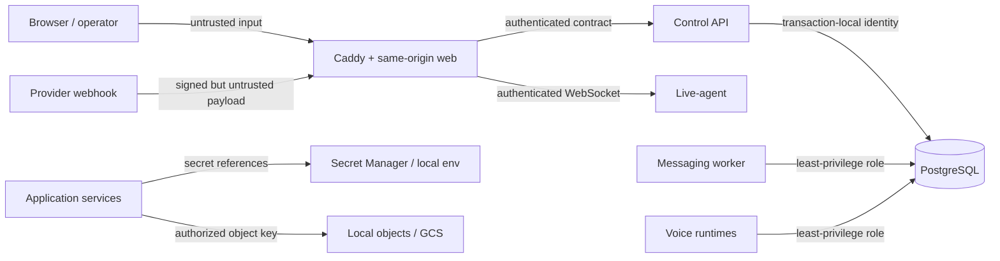

# Platform threat model

Status: living architecture threat model

Last reviewed: 2026-09-02 (Phase 6 WhatsApp provider boundary)

Scope: Phase 1 foundation and the explicitly planned unified platform

## Security objective

Protect tenant isolation, identity, provider authority, conversations, media,
agent/tool execution, and PostgreSQL data while integrating three working systems.
The foundation must fail closed when an authority or mandatory dependency is
missing. This document does not claim that deferred product controls already
exist.

## Assets and trust boundaries

Critical assets include tenant business records, contact/conversation content,
call media and transcripts, agent prompts/tool permissions, provider credentials,
authentication sessions, PostgreSQL data/backups, object metadata and bytes,
deployment identities, source/lockfiles, and migration history.

Every arrow crosses a trust boundary. Browser, provider payload, uploaded media,
model output, tool result, source dependency, and restored backup are untrusted
until their boundary validates identity, integrity, authorization, type, and size.

## Adversaries and failure modes

- unauthenticated internet attackers and forged provider clients;
- authenticated users attempting horizontal or vertical privilege escalation;
- compromised tenant users, provider tokens, service credentials, or CI jobs;
- malicious uploads, URLs, prompt content, tools, packages, containers, and model
  artifacts;
- accidental operator misuse, unsafe defaults, replayed jobs, and migration or
  backup mistakes;
- compromised internal process attempting lateral movement.

## Threat register

| Threat | Impact / likely path | Implemented Phase 1 controls | Planned controls before affected feature ships |
| --- | --- | --- | --- |
| Tenant breakout | Missing context, IDOR, unsafe joins, pooled-session leakage | PostgreSQL-only direction; separate non-superuser runtime role; no tenant feature is represented as complete | Canonical memberships/permissions; `SET LOCAL` tenant/user/role; forced fail-closed RLS; cross-tenant negative and pool-reset tests |
| Broken authorization | UI-only checks, role confusion, direct object access | Canonical membership roles, deny-by-default typed permission matrix, server-side session resolution, last-owner database guard | Object-level policies for each feature, audited admin elevation, permission fixtures for ported domains |
| Credential leakage | Source, image layer, log, diagnostics, fixture, Terraform state | `.env*` ignored except examples; typed diagnostics and structured log redaction; tracked-file secret scan; no real credentials or service-account JSON | Secret Manager and VM identity; envelope encryption with external master key; rotation/revocation runbooks and credential access audit |
| Webhook forgery | Fake WhatsApp/telephony events create work | No provider webhook or traffic exists in Phase 1 | Raw-body signature verification, constant-time comparison, provider/account binding, timestamp validation, narrow route limits |
| Webhook replay | Captured valid request repeats side effects | No provider side-effect implementation | Durable inbox unique provider-event ID, replay window, idempotent transaction, duplicate metrics and quarantine |
| CSRF | Authenticated browser tricked into mutation | `SameSite=Lax` opaque session cookie, session-bound double-submit token, Origin and Fetch Metadata checks on unsafe auth routes, no state-changing GET | Apply the same shared guard to every future mutation and add edge-level CSP/header enforcement |
| XSS | Stored message/contact/model output executes in operator browser | React escaping and CSP-compatible architecture; no rich-text/HTML product feature | Strict renderers/sanitization, CSP with nonces, Trusted Types evaluation, URL allowlists, stored-XSS tests |
| SSRF | Webhook/tool/media URL reaches metadata or internal services | No URL-fetching provider adapter; service boundaries documented | Central egress policy, parsed URL/IP validation after DNS, redirect revalidation, metadata/private/link-local denylist, size/time budgets |
| Malicious uploads | Parser exploit, polyglot, oversized object, cross-tenant access | Full upload path absent; object-storage ADR separates bytes from PostgreSQL metadata | Streaming limits, MIME/signature checks, random tenant-bound keys, quarantine/scanning, checksum, safe download disposition, retention/deletion |
| WebSocket authentication | Stolen/anonymous socket observes or controls live sessions | 60-second issuer/audience/capability-bound signed live-session grant and live-agent validator | Bind grant to actual OpenLive session, validate browser origin, authorize every message, add rate/size limits and revocation fan-out |
| Service-to-service trust | Compromised web/worker impersonates another runtime | Private Compose network, distinct future roles, loopback-only host ports, no shared superuser app DSN | Workload identities or rotated service credentials, audience-bound tokens/mTLS evaluation, network segmentation, per-service DB grants |
| Prompt/tool abuse | Content induces agent to exfiltrate secrets or invoke dangerous tools | No product tool execution; explicit contract boundaries and secret references | Versioned tool allowlists, argument schemas, tenant authorization, confirmation for consequential actions, sandboxing, output filtering, audit trail |
| Call abuse | Fraud, premium dialing, harassment, runaway retries | `ENABLE_REAL_TELEPHONY=false` default; developer runner refuses enabled flag; development endpoint accepts only simulator mode; real boundary requires both flag and explicit per-action approval; idempotent simulator never resolves a phone number | Destination policy, budget/concurrency/rate limits, consent/legal checks, kill switch, and protected manual real-provider smoke |
| WhatsApp abuse | Spam, unauthorized campaign, template/account misuse | `ENABLE_REAL_WHATSAPP=false` default tested in both languages; no send adapter; developer runner refuses enabled flag | Explicit approval plus flag, RBAC, recipient/template policy, opt-out/suppression, campaign caps, outbox idempotency, audit and kill switch |
| PostgreSQL exposure | Internet access, shared superuser, weak tenant boundary | Loopback-only Compose mapping, private network, pinned PostgreSQL, named volume, app uses `platform_web`, Alembic uses migrator | VM firewall/private binding, TLS where crossing hosts, forced RLS, per-service grants, connection limits, audit/monitoring and patch runbook |
| Backup exposure | Snapshot contains all tenants/credentials and is copied or restored unsafely | Backups not implemented or claimed in Phase 1 | Encrypted versioned GCS bucket, narrow backup identity, retention/lock policy, checksums, restore-to-new-DB drills, access logging and deletion process |
| Supply-chain compromise | Malicious action/package/image/model alters build/runtime | Frozen pnpm/uv locks; package age/build allowlist; CI actions pinned to commit; target-only build; secret and architecture scans | Signed images/SBOM/provenance, digest pins, protected dependency updates, model checksums/licenses, isolated builders, incident revocation |
| Dependency compromise | Known vulnerable framework/native library exploited | Patched baseline, `pnpm audit`, `pip-audit`, strict compatibility gates, critical issues block by policy | Container/OS scanning, scheduled updates, VEX/time-bounded exceptions, full retained-engine regression tests before upgrades |

## Implemented Phase 1 controls

- PostgreSQL is the only runtime database; runtime dependency/import and Compose
  image guards reject prohibited stores and Supabase/Firebase clients.
- Alembic is the only migration lineage; CI checks one head and a database at head.
- Compose publishes PostgreSQL and current app ports to loopback only. Application
  containers use non-root OS users and `platform_web`, never the migrator DSN.
- Provider flags default false in TypeScript and Python tests. Normal developer
  commands reject any non-false value and contain no send/call/webhook code.
- Typed configuration is loaded at entrypoints; diagnostic and logging helpers
  redact nested sensitive keys and database URLs.
- Lockfiles, exact runtime versions, reviewed native build allowlists, immutable CI
  action SHAs, dependency audits, secret scanning, and sibling-independence checks
  are committed gates.
- Liveness and readiness are distinct; PostgreSQL failure produces degraded
  readiness rather than a decorative success.

## Implemented Phase 3 identity controls

- PostgreSQL is the sole user, membership, credential, and session authority;
  Alembic remains its only migration authority.
- Passwords use Argon2id. Session and CSRF tokens have 256 bits of random entropy;
  only peppered HMAC-SHA-256 digests are stored.
- Login returns a generic failure, performs dummy-hash work for unknown users,
  locks credentials after bounded failures, and never logs credentials/tokens.
- Sessions enforce idle and absolute expiry, membership/user/tenant status,
  explicit revocation, and token rotation on tenant switch.
- Authentication tables have no direct `platform_web` access. Narrow
  `SECURITY DEFINER` functions pin `search_path`, revoke `PUBLIC`, and are covered
  by live PostgreSQL privilege and lifecycle tests.
- Authentication and tenant-switch audit records are immutable to ordinary
  runtime roles. The final tenant owner cannot be removed or demoted accidentally.
- Local bootstrap generates ignored secrets and a fictional operator credential;
  real provider flags remain false and unrelated to identity activation.

## Implemented Phase 5 simulator controls

- The authenticated browser reaches voice operations only through same-origin
  BFF routes, canonical RBAC, short-lived audience-bound assertions, and the
  least-privilege `platform_voice` PostgreSQL role.
- DID admission rejects empty, catch-all IPv4, and catch-all IPv6 ACLs. Phase 5
  persists only deterministic simulator rules; reconciliation is read-only and
  never repairs provider state implicitly.
- Call commands are idempotent per tenant and reject reuse for a different
  contact or simulator scenario. Campaign calls are idempotent per campaign and
  contact, and only active contacts with explicit granted voice consent and a
  validated E.164 channel identity are eligible.
- Flow validation executes before persistence and published `(flow_id, version)`
  content is immutable. Campaign concurrency and attempt counts have database
  constraints; calling windows use named IANA time zones.
- Audit records contain identifiers, simulator mode, scenario, and aggregate
  counts only. Provider credentials, phone numbers, transcript content, and
  provider payloads are not audit metadata.
- Completed, no-answer, failed, and cancelled simulator lifecycles release their
  logical resources without LiveKit, carrier, STT, TTS, or LLM traffic.
- The simulator mutation is development-only, applies the shared Origin,
  Fetch-Metadata, and session-bound CSRF controls, and accepts only a literal
  simulator mode. It has no provider client, telephone number, trunk, or
  credential input.
- One transaction persists the retained session, ordered lifecycle events,
  durable outbox records, and immutable audit record. Replays are idempotent,
  and reusing a key for a different contact is rejected.
- The future real-provider authorization primitive denies unless both the
  trusted feature flag and explicit per-action approval are present. No real
  provider adapter is connected to the simulator route.

## Implemented Phase 6 cross-channel controls

- Agent and flow records use forced tenant RLS; published versions are immutable.
- Only `voice` and `whatsapp` are executable capabilities. OpenLive is rejected
  and remains a final-phase integration.
- Same-origin mutations require the existing authenticated session, RBAC,
  Origin/Fetch-Metadata checks, and CSRF token.
- Cross-channel demonstrations write literal simulator jobs. The separate Inbox
  Meta path requires an explicit provider selection and cannot be selected as a
  fallback.
- Call follow-up requires a terminal contact-linked retained session. A
  WhatsApp-triggered call derives its contact from the tenant-scoped conversation
  and requires explicit voice consent.
- Handoff requests are idempotent and status transitions are compare-and-set;
  concurrent accept tests prove one winner.
- The activity view invokes source-table RLS and exposes only safe identifiers,
  statuses, timing, and aggregate metadata—not bodies, transcripts, prompts,
  phone numbers, or credentials.
- Audit records cover agent/flow create and publish, simulator queueing, and
  handoff state changes without storing customer content or secrets.
- Monetary cost is never inferred from incomplete price data; unpriced usage is
  shown explicitly.
- Real WhatsApp admission and the lowest Meta adapter independently enforce the
  default-off kill switch. Admission also requires RBAC, CSRF/origin checks,
  explicit UI plus browser confirmation, tenant idempotency, active contact,
  granted consent, no opt-out, and strict E.164.
- Free-form text fails closed outside the server-maintained 24-hour customer
  service window. Templates are sent through Meta's template payload; Meta's
  approval policy is not bypassed.
- Meta calls run after the durable job/load transaction ends. Timeout and
  transient retries are bounded; errors expose only safe codes. Logs/audit/job
  payloads omit tokens, app secrets, bodies, and phone numbers.
- GET webhook verification uses an env-only token. POST signatures cover exact
  raw bytes, and provider events are persisted/deduplicated before acknowledgement.
  Status application is tenant-scoped and monotonic.

## Phase 6 simulator execution controls (implemented)

- Voice jobs have a dedicated claim function, restricted queue/type RLS and
  `platform_voice` grants; no generic all-tenant claim or messaging-table access.
  Eligibility locks active contact/consent/tenant/operator membership until the
  simulator effects and job completion commit. Savepoints discard partial effects
  on failure; bounded retries and expired final leases are tested on PostgreSQL.
- Canonical runs pin immutable versions, recheck active owner/admin/editor
  membership on execution, bound graph size and duration, and wait for durable
  child success before handoff. Literal simulator mode is enforced; no real
  provider selector exists in this coordinator. CRM writes are column-allow-listed.
- New SECURITY DEFINER helpers use fixed `pg_catalog` search paths, qualified
  names, explicit execute grants and no PUBLIC execute. No additional identity
  table SELECT is granted to web/messaging roles. Existing tenant RLS remains.
- Flow credential-field rejection is defense in depth, not a generic secret
  detector: users must never paste secrets into prompts, message text or drafts.

## Outstanding security work

The 2026-09-02 dependency scan reports high-severity
`GHSA-8mgp-746c-j5xp` in transitive `nltk==3.10.3`, with no patched release
available. The affected model-artifact APIs are not called by the platform and
no caller-controlled NLTK model path is accepted. This is a time-bounded
non-exploitability exception, not a clean scan: review weekly and upgrade as
soon as an upstream patched stable release is compatible. Next review:
2026-09-09; exception owner: platform security.

Public signup, OAuth/OIDC, MFA/WebAuthn, self-service recovery, full WebSocket session
binding, object scanning,
service identities, encrypted credential persistence, backup/restore, rate limits,
abuse controls, and production telemetry are not implemented in Phase 1. Each is
a release gate for the feature that needs it, not a documentation-only promise.

## Security invariants

1. Missing tenant or user context denies tenant data.
2. No application process receives a superuser or migrator DSN.
3. No provider side effect occurs from tests, bootstrap, seed, health, or verify.
4. Provider action requires both an enabled flag and explicit user approval at the
   action boundary.
5. Secrets are references, not embedded in agent/profile/event JSON.
6. External input never determines an unrestricted file path, URL fetch, SQL
   fragment, provider destination, or tool invocation.
7. A migration, restore, or deploy is not successful until readiness and smoke
   checks pass; rollback never rewrites migration history.

## Review triggers

### Phase 7 public/bilingual presentation review

Implemented: the locale proxy validates EN/HE and overwrites incoming locale
metadata; locale is never identity/tenant authorization. Presentation permission
checks only hide/disable inappropriate controls; all existing server RBAC,
CSRF/session and PostgreSQL RLS checks remain authoritative. Public canonical
origins reject embedded credentials and arbitrary paths. Translations and
customer text render as React text, not raw HTML. UI failures use safe allowlisted
messages, and no provider secrets enter page props. Native form validation is UX,
not a substitute for server validation. Real-send review, consent and provider
kill switches are retained.

Public signup, commercial pricing, legal guarantees, external lead submissions,
tracking and unimplemented authentication flows were not added. Production legal
content, assistive-technology acceptance and complete simulator rehearsals remain
open. The isolated UI preview removes real-provider environment values and cannot
connect to the developer control API or consume developer queues.

### WhatsApp diagnostic disclosure

Implemented: provider error code fields accept bounded numbers only. HTTP error
descriptions are mapped to fixed safe reason enums, never persisted verbatim or
logged. The parser drops arbitrary fields at both provider and database/API
boundaries, including provider trace strings. The Inbox renders localized text
and numeric codes, not raw HTML. Existing tenant RLS and `crm:read` protect reads;
diagnostic controls cannot requeue/send. Mocked HTTP and isolated PostgreSQL tests
cover token/recipient/body omission, tenant isolation and clearing stale details
after success. No existing developer failures or queues are mutated by this work.

Limit: unknown provider wording is intentionally unavailable, so a numeric code
alone may still be insufficient for a definitive root cause. Future recognized
reason additions require redaction regression fixtures; never switch to logging
the complete Meta error object to bypass this limitation.

### Ongoing review

User-authorized local WhatsApp tunnel: the separate Caddy edge permits only the
exact webhook route and GET/POST, caps body size at 1 MB and applies timeouts.
Everything else is 404; PostgreSQL/core networks are not exposed. Containers run
non-root/read-only without provider credentials, with pinned images, limited
resources and no persisted request logs. The official Caddy executable's
NET_BIND_SERVICE file capability is retained; all other capabilities are dropped.
Next development request logging excludes callback URLs to protect verification
query tokens. The app remains the signature/flag/deduplication authority.

Cloudflare processes HTTPS callback traffic; quick tunnels are temporary and have
no uptime guarantee. No claim is made about Cloudflare-side logging, production
DoS resistance, dedicated per-sender rate limiting or WAF controls. Stop the
explicit tunnel after development testing. Actual Meta subscription/inbound
delivery remains a separate user-performed acceptance step. See the
[webhook runbook](../runbooks/whatsapp-webhook-local.md).

Review this model before adding authentication, tenant tables/RLS, public
webhooks, real provider adapters, uploads, WebSocket protocol messages, tool
execution, GCP resources, backup automation, or any new externally reachable
port. Record material architecture changes in an ADR.
