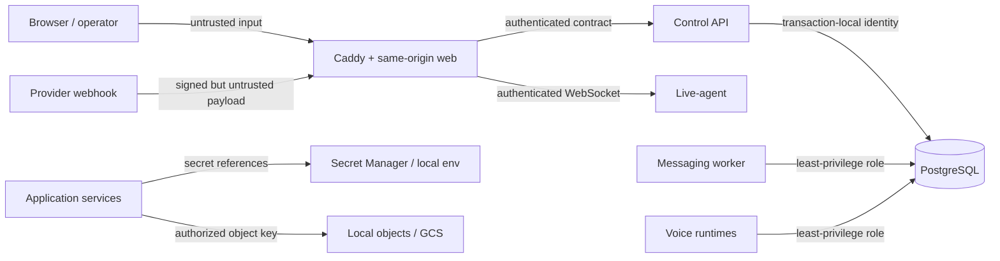

# Platform threat model

Status: living architecture threat model

Last reviewed: 2026-09-01 (Phase 3 identity boundary)

Scope: Phase 1 foundation and the explicitly planned unified platform

## Security objective

Protect tenant isolation, identity, provider authority, conversations, media,
agent/tool execution, and PostgreSQL data while integrating three working systems.
The foundation must fail closed when an authority or mandatory dependency is
missing. This document does not claim that deferred product controls already
exist.

## Assets and trust boundaries

Critical assets include tenant business records, contact/conversation content,
call media and transcripts, agent prompts/tool permissions, provider credentials,
authentication sessions, PostgreSQL data/backups, object metadata and bytes,
deployment identities, source/lockfiles, and migration history.

Every arrow crosses a trust boundary. Browser, provider payload, uploaded media,
model output, tool result, source dependency, and restored backup are untrusted
until their boundary validates identity, integrity, authorization, type, and size.

## Adversaries and failure modes

- unauthenticated internet attackers and forged provider clients;
- authenticated users attempting horizontal or vertical privilege escalation;
- compromised tenant users, provider tokens, service credentials, or CI jobs;
- malicious uploads, URLs, prompt content, tools, packages, containers, and model
  artifacts;
- accidental operator misuse, unsafe defaults, replayed jobs, and migration or
  backup mistakes;
- compromised internal process attempting lateral movement.

## Threat register

| Threat | Impact / likely path | Implemented Phase 1 controls | Planned controls before affected feature ships |
| --- | --- | --- | --- |
| Tenant breakout | Missing context, IDOR, unsafe joins, pooled-session leakage | PostgreSQL-only direction; separate non-superuser runtime role; no tenant feature is represented as complete | Canonical memberships/permissions; `SET LOCAL` tenant/user/role; forced fail-closed RLS; cross-tenant negative and pool-reset tests |
| Broken authorization | UI-only checks, role confusion, direct object access | Canonical membership roles, deny-by-default typed permission matrix, server-side session resolution, last-owner database guard | Object-level policies for each feature, audited admin elevation, permission fixtures for ported domains |
| Credential leakage | Source, image layer, log, diagnostics, fixture, Terraform state | `.env*` ignored except examples; typed diagnostics and structured log redaction; tracked-file secret scan; no real credentials or service-account JSON | Secret Manager and VM identity; envelope encryption with external master key; rotation/revocation runbooks and credential access audit |
| Webhook forgery | Fake WhatsApp/telephony events create work | No provider webhook or traffic exists in Phase 1 | Raw-body signature verification, constant-time comparison, provider/account binding, timestamp validation, narrow route limits |
| Webhook replay | Captured valid request repeats side effects | No provider side-effect implementation | Durable inbox unique provider-event ID, replay window, idempotent transaction, duplicate metrics and quarantine |
| CSRF | Authenticated browser tricked into mutation | `SameSite=Lax` opaque session cookie, session-bound double-submit token, Origin and Fetch Metadata checks on unsafe auth routes, no state-changing GET | Apply the same shared guard to every future mutation and add edge-level CSP/header enforcement |
| XSS | Stored message/contact/model output executes in operator browser | React escaping and CSP-compatible architecture; no rich-text/HTML product feature | Strict renderers/sanitization, CSP with nonces, Trusted Types evaluation, URL allowlists, stored-XSS tests |
| SSRF | Webhook/tool/media URL reaches metadata or internal services | No URL-fetching provider adapter; service boundaries documented | Central egress policy, parsed URL/IP validation after DNS, redirect revalidation, metadata/private/link-local denylist, size/time budgets |
| Malicious uploads | Parser exploit, polyglot, oversized object, cross-tenant access | Full upload path absent; object-storage ADR separates bytes from PostgreSQL metadata | Streaming limits, MIME/signature checks, random tenant-bound keys, quarantine/scanning, checksum, safe download disposition, retention/deletion |
| WebSocket authentication | Stolen/anonymous socket observes or controls live sessions | 60-second issuer/audience/capability-bound signed live-session grant and live-agent validator | Bind grant to actual OpenLive session, validate browser origin, authorize every message, add rate/size limits and revocation fan-out |
| Service-to-service trust | Compromised web/worker impersonates another runtime | Private Compose network, distinct future roles, loopback-only host ports, no shared superuser app DSN | Workload identities or rotated service credentials, audience-bound tokens/mTLS evaluation, network segmentation, per-service DB grants |
| Prompt/tool abuse | Content induces agent to exfiltrate secrets or invoke dangerous tools | No product tool execution; explicit contract boundaries and secret references | Versioned tool allowlists, argument schemas, tenant authorization, confirmation for consequential actions, sandboxing, output filtering, audit trail |
| Call abuse | Fraud, premium dialing, harassment, runaway retries | `ENABLE_REAL_TELEPHONY=false` default tested in both languages; no call adapter; developer runner refuses enabled flag | Explicit user approval plus flag, destination policy, budget/concurrency/rate limits, consent/legal checks, idempotency and kill switch |
| WhatsApp abuse | Spam, unauthorized campaign, template/account misuse | `ENABLE_REAL_WHATSAPP=false` default tested in both languages; no send adapter; developer runner refuses enabled flag | Explicit approval plus flag, RBAC, recipient/template policy, opt-out/suppression, campaign caps, outbox idempotency, audit and kill switch |
| PostgreSQL exposure | Internet access, shared superuser, weak tenant boundary | Loopback-only Compose mapping, private network, pinned PostgreSQL, named volume, app uses `platform_web`, Alembic uses migrator | VM firewall/private binding, TLS where crossing hosts, forced RLS, per-service grants, connection limits, audit/monitoring and patch runbook |
| Backup exposure | Snapshot contains all tenants/credentials and is copied or restored unsafely | Backups not implemented or claimed in Phase 1 | Encrypted versioned GCS bucket, narrow backup identity, retention/lock policy, checksums, restore-to-new-DB drills, access logging and deletion process |
| Supply-chain compromise | Malicious action/package/image/model alters build/runtime | Frozen pnpm/uv locks; package age/build allowlist; CI actions pinned to commit; target-only build; secret and architecture scans | Signed images/SBOM/provenance, digest pins, protected dependency updates, model checksums/licenses, isolated builders, incident revocation |
| Dependency compromise | Known vulnerable framework/native library exploited | Patched baseline, `pnpm audit`, `pip-audit`, strict compatibility gates, critical issues block by policy | Container/OS scanning, scheduled updates, VEX/time-bounded exceptions, full retained-engine regression tests before upgrades |

## Implemented Phase 1 controls

- PostgreSQL is the only runtime database; runtime dependency/import and Compose
  image guards reject prohibited stores and Supabase/Firebase clients.
- Alembic is the only migration lineage; CI checks one head and a database at head.
- Compose publishes PostgreSQL and current app ports to loopback only. Application
  containers use non-root OS users and `platform_web`, never the migrator DSN.
- Provider flags default false in TypeScript and Python tests. Normal developer
  commands reject any non-false value and contain no send/call/webhook code.
- Typed configuration is loaded at entrypoints; diagnostic and logging helpers
  redact nested sensitive keys and database URLs.
- Lockfiles, exact runtime versions, reviewed native build allowlists, immutable CI
  action SHAs, dependency audits, secret scanning, and sibling-independence checks
  are committed gates.
- Liveness and readiness are distinct; PostgreSQL failure produces degraded
  readiness rather than a decorative success.

## Implemented Phase 3 identity controls

- PostgreSQL is the sole user, membership, credential, and session authority;
  Alembic remains its only migration authority.
- Passwords use Argon2id. Session and CSRF tokens have 256 bits of random entropy;
  only peppered HMAC-SHA-256 digests are stored.
- Login returns a generic failure, performs dummy-hash work for unknown users,
  locks credentials after bounded failures, and never logs credentials/tokens.
- Sessions enforce idle and absolute expiry, membership/user/tenant status,
  explicit revocation, and token rotation on tenant switch.
- Authentication tables have no direct `platform_web` access. Narrow
  `SECURITY DEFINER` functions pin `search_path`, revoke `PUBLIC`, and are covered
  by live PostgreSQL privilege and lifecycle tests.
- Authentication and tenant-switch audit records are immutable to ordinary
  runtime roles. The final tenant owner cannot be removed or demoted accidentally.
- Local bootstrap generates ignored secrets and a fictional operator credential;
  real provider flags remain false and unrelated to identity activation.

## Planned controls

Public signup, OAuth/OIDC, MFA/WebAuthn, self-service recovery, domain-specific
object authorization, provider signature/replay handling, full WebSocket session
binding, object scanning,
service identities, encrypted credential persistence, backup/restore, rate limits,
abuse controls, and production telemetry are not implemented in Phase 1. Each is
a release gate for the feature that needs it, not a documentation-only promise.

## Security invariants

1. Missing tenant or user context denies tenant data.
2. No application process receives a superuser or migrator DSN.
3. No provider side effect occurs from tests, bootstrap, seed, health, or verify.
4. Provider action requires both an enabled flag and explicit user approval at the
   action boundary.
5. Secrets are references, not embedded in agent/profile/event JSON.
6. External input never determines an unrestricted file path, URL fetch, SQL
   fragment, provider destination, or tool invocation.
7. A migration, restore, or deploy is not successful until readiness and smoke
   checks pass; rollback never rewrites migration history.

## Review triggers

Review this model before adding authentication, tenant tables/RLS, public
webhooks, real provider adapters, uploads, WebSocket protocol messages, tool
execution, GCP resources, backup automation, or any new externally reachable
port. Record material architecture changes in an ADR.
